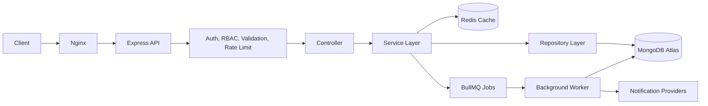

# Multi-Tenant SaaS Backend

Production-grade backend architecture documentation for a multi-tenant SaaS support platform built with Node.js, Express, MongoDB, Redis, BullMQ, JWT authentication, RBAC, Docker, and CI/CD.

This repository is intentionally documentation-first. It does not contain application source code yet. The goal is to design the system clearly enough that implementation can proceed without architectural guesswork.

## Project Overview

The system is a modular monolith backend for a multi-tenant SaaS application where organizations can manage users, teams, tickets, comments, attachments, notifications, and audit logs.

The project is designed for backend-focused portfolio and interview use. It demonstrates practical production engineering without pretending to solve FAANG-scale distributed systems problems.

Primary goals:

- Show clean backend architecture using Node.js and Express.
- Demonstrate secure authentication and authorization.
- Model real multi-tenant data isolation with MongoDB.
- Use Redis and BullMQ where they solve concrete problems.
- Provide defensible API, database, testing, deployment, and observability decisions.
- Keep the architecture realistic for a high-quality startup backend.

## Architecture Overview

The backend follows a modular monolith architecture with clean layered boundaries.

The documentation sequence intentionally defines glossary, requirements, and domain model before technical architecture. The domain model explains the business concepts, ownership rules, lifecycles, and invariants that the system architecture must preserve.

Core layers:

- **Routes**: HTTP entry points and request routing.
- **Controllers**: Request parsing, response shaping, and delegation.
- **Services**: Business rules, workflows, authorization orchestration, and transaction boundaries.
- **Repositories**: MongoDB data access and persistence concerns.
- **Middleware**: Authentication, RBAC, validation, rate limiting, error handling, request context, and logging.
- **Infrastructure adapters**: Redis, BullMQ, email or notification providers, object storage, and external integrations.

High-level request lifecycle:



The architecture intentionally avoids microservices, Kubernetes, Kafka, GraphQL, CQRS, and event sourcing. Those patterns add operational and cognitive overhead that is not justified for this project scope.

## Features

Planned backend capabilities:

- Organization and tenant management.
- User registration, login, logout, refresh token rotation, and session invalidation.
- JWT access tokens with secure refresh token storage.
- Password hashing with bcrypt.
- Role-based access control across platform, organization, and team scopes.
- Tenant isolation using shared database multi-tenancy.
- Team management inside organizations.
- Ticket creation, assignment, status workflows, priority, filtering, searching, and pagination.
- Ticket comments with audit-friendly history.
- Attachment metadata handling with external object storage integration planned.
- Notification scheduling and delivery through BullMQ workers.
- Audit logs for security-sensitive and business-critical actions.
- Redis caching for read-heavy and session-adjacent data.
- Structured logging, health checks, and operational diagnostics.
- Swagger/OpenAPI documentation.
- Unit, integration, API, auth, authorization, tenant isolation, and performance testing strategy.
- Docker, Docker Compose, GitHub Actions, Nginx, Render, MongoDB Atlas, and Upstash Redis deployment path.

## Technology Stack

| Area | Technology | Reason |
|---|---|---|
| Runtime | Node.js | Mature JavaScript runtime for backend APIs. |
| Framework | Express.js | Minimal, widely understood, interview-friendly HTTP framework. |
| Database | MongoDB Atlas | Flexible document model for SaaS entities and tenant-scoped data. |
| Cache | Redis / Upstash Redis | Caching, rate limiting support, and BullMQ backing store. |
| Queue | BullMQ | Reliable background jobs using Redis. |
| Auth | JWT + Refresh Tokens | Stateless access tokens with controlled session renewal. |
| Password Security | bcrypt | Standard adaptive password hashing. |
| API Docs | Swagger / OpenAPI | Contract-first API visibility and testing support. |
| Testing | Jest + Supertest | Unit and API integration testing. |
| Deployment | Docker, Docker Compose, Nginx, Render | Practical deployment flow for portfolio and free-tier hosting. |
| CI/CD | GitHub Actions | Automated linting, tests, and deployment checks. |

## Project Structure

Initial documentation-only structure:

```text
multi-tenant-saas-backend/
├── README.md
└── docs/
    ├── 00-glossary.md
    ├── 01-project-vision.md
    ├── 02-functional-requirements.md
    ├── 03-non-functional-requirements.md
    ├── 04-domain-model.md
    ├── 05-system-architecture.md
    ├── 06-module-architecture.md
    ├── 07-folder-structure.md
    ├── 08-database-design.md
    ├── 09-api-specification.md
    ├── 10-authentication-design.md
    ├── 11-rbac-design.md
    ├── 12-multi-tenancy-design.md
    ├── 13-background-jobs.md
    ├── 14-caching-strategy.md
    ├── 15-logging-monitoring.md
    ├── 16-error-handling.md
    ├── 17-security.md
    ├── 18-testing-strategy.md
    ├── 19-infrastructure.md
    ├── 20-deployment.md
    ├── 21-performance.md
    ├── 22-architecture-decisions.md
    ├── 23-development-roadmap.md
    ├── 24-resume-feature-mapping.md
    └── 25-interview-preparation.md
```

The Domain Model acts as the bridge between Requirements Engineering and System Architecture by defining the business concepts before technical implementation.

Implementation-stage source structure will be defined later in `docs/07-folder-structure.md`. Source files should not be created until the architecture documentation is complete and reviewed.

## Document Sequence

The documentation must be developed in this order:

1. Terminology and product intent.
2. Functional and non-functional requirements.
3. Domain model.
4. Technical architecture.
5. Module, folder, database, API, auth, RBAC, tenancy, jobs, caching, logging, errors, security, testing, infrastructure, deployment, performance, ADR, roadmap, resume, and interview documents.

This order prevents technical design from outrunning business rules.

## Documentation Index

| Document | Status | Purpose |
|---|---:|---|
| [00-glossary.md](docs/00-glossary.md) | Draft | Defines official terminology and naming rules. |
| [01-project-vision.md](docs/01-project-vision.md) | Draft | Defines the product vision, target user, project boundaries, and success criteria. |
| [02-functional-requirements.md](docs/02-functional-requirements.md) | Draft | Defines concrete business capabilities and user workflows. |
| [03-non-functional-requirements.md](docs/03-non-functional-requirements.md) | Draft | Defines quality attributes: security, performance, reliability, maintainability, and observability. |
| [04-domain-model.md](docs/04-domain-model.md) | Draft | Defines business domains, aggregates, entities, value objects, ownership rules, invariants, lifecycles, and domain events. |
| [05-system-architecture.md](docs/05-system-architecture.md) | Draft | Describes the high-level backend architecture and request lifecycle. |
| [06-module-architecture.md](docs/06-module-architecture.md) | Draft | Breaks the system into domain modules and responsibilities. |
| [07-folder-structure.md](docs/07-folder-structure.md) | Draft | Defines the future source-code organization. |
| [08-database-design.md](docs/08-database-design.md) | Draft | Documents collections, relationships, validation, indexes, TTLs, and aggregation opportunities. |
| [09-api-specification.md](docs/09-api-specification.md) | Draft | Defines endpoints, request bodies, responses, validation, auth, and errors. |
| [10-authentication-design.md](docs/10-authentication-design.md) | Draft | Defines JWT, refresh tokens, password hashing, sessions, and cookie strategy. |
| [11-rbac-design.md](docs/11-rbac-design.md) | Draft | Defines roles, permissions, enforcement points, and authorization risks. |
| [12-multi-tenancy-design.md](docs/12-multi-tenancy-design.md) | Draft | Defines tenant isolation model, tenant resolution, and data access rules. |
| [13-background-jobs.md](docs/13-background-jobs.md) | Draft | Defines BullMQ queues, workers, retries, idempotency, and job observability. |
| [14-caching-strategy.md](docs/14-caching-strategy.md) | Draft | Defines Redis usage, cache keys, invalidation, TTLs, and failure behavior. |
| [15-logging-monitoring.md](docs/15-logging-monitoring.md) | Draft | Defines structured logging, health checks, metrics, and operational visibility. |
| [16-error-handling.md](docs/16-error-handling.md) | Draft | Defines error taxonomy, response shape, status mapping, and observability expectations. |
| [17-security-design.md](docs/17-security-design.md) | Draft | Defines authentication, authorization, tenant isolation, secrets, and secure-by-default controls. |
| [18-testing-strategy.md](docs/18-testing-strategy.md) | Draft | Defines unit, integration, end-to-end, and quality-gate expectations for production readiness. |
| [19-infrastructure-deployment.md](docs/19-infrastructure-deployment.md) | Draft | Defines deployment topology, environments, runtime architecture, scaling, and release workflow. |
| [20-performance-scalability.md](docs/20-performance-scalability.md) | Draft | Defines performance goals, scalability approach, caching, throughput, and monitoring priorities. |
| [21-operational-runbooks.md](docs/21-operational-runbooks.md) | Draft | Defines incident response, health checks, rollback, escalation, and service operations expectations. |
| [22-architecture-decision-records.md](docs/22-architecture-decision-records.md) | Draft | Defines how architectural choices and trade-offs are recorded over time. |
| [23-roadmap-and-future-state.md](docs/23-roadmap-and-future-state.md) | Draft | Defines near-term, medium-term, and long-term platform evolution priorities. |
| [24-interview-prep-and-resume-alignment.md](docs/24-interview-prep-and-resume-alignment.md) | Draft | Connects the architecture work to interview framing, resume language, and senior-level storytelling. |
| [25-project-summary-and-execution-plan.md](docs/25-project-summary-and-execution-plan.md) | Draft | Provides the executive summary and a practical plan for extending the project. |
| [16-error-handling.md](docs/16-error-handling.md) | Pending | Defines error taxonomy, API response format, and centralized handling. |
| [17-security.md](docs/17-security.md) | Pending | Defines security controls across auth, input validation, CORS, Helmet, secrets, and rate limiting. |
| [18-testing-strategy.md](docs/18-testing-strategy.md) | Pending | Defines test pyramid, tooling, fixtures, and critical test scenarios. |
| [19-infrastructure.md](docs/19-infrastructure.md) | Pending | Defines Docker, environment configuration, services, and local infrastructure. |
| [20-deployment.md](docs/20-deployment.md) | Pending | Defines deployment flow for Render, MongoDB Atlas, Upstash Redis, Nginx, and GitHub Actions. |
| [21-performance.md](docs/21-performance.md) | Pending | Defines indexing, pagination, compression, load testing, and honest metric measurement. |
| [22-architecture-decisions.md](docs/22-architecture-decisions.md) | Pending | Records major ADRs and trade-offs. |
| [23-development-roadmap.md](docs/23-development-roadmap.md) | Pending | Defines phased implementation order. |
| [24-resume-feature-mapping.md](docs/24-resume-feature-mapping.md) | Pending | Maps implemented features to truthful resume bullets and measurable evidence. |
| [25-interview-preparation.md](docs/25-interview-preparation.md) | Pending | Prepares technical explanations, trade-offs, and interview defense points. |

## Development Workflow

Documentation workflow:

1. Generate and review one document at a time.
2. Define terminology, requirements, and the domain model before technical architecture.
3. Keep each document focused on architecture and implementation guidance, not source code.
4. Capture design decisions and trade-offs as they are made.
5. Update the documentation index status only when a document is complete.
6. Start implementation only after the architecture docs are coherent as a full system.

Future implementation workflow:

1. Create the backend folder structure from `docs/07-folder-structure.md`.
2. Implement foundational middleware first: config, errors, logging, validation, auth context, and request context.
3. Implement authentication and organization modules before tenant-scoped business modules.
4. Add repositories and indexes with database validation rules.
5. Add tests with each module instead of after the fact.
6. Add background jobs, caching, observability, and deployment hardening once core flows are stable.

## Deployment Overview

Planned deployment path:

- Local development with Docker Compose.
- MongoDB Atlas for managed database hosting.
- Upstash Redis for Redis-compatible cache and queue backing.
- Render free tier for API deployment.
- Nginx as reverse proxy in containerized deployment environments where applicable.
- GitHub Actions for lint, test, build, and deployment validation.

Production-readiness concerns to document before implementation:

- Environment variable validation.
- Secret rotation assumptions.
- Health check behavior.
- Database connection lifecycle.
- Redis outage behavior.
- Graceful shutdown for API and workers.
- Queue retry and dead-letter strategy.
- Structured logs with request correlation IDs.
- Rate limits per IP, user, tenant, and sensitive endpoint where appropriate.

## Future Roadmap

Planned phases:

| Phase | Focus |
|---|---|
| Phase 1 | Terminology, requirements, domain model, architecture documentation, and review. |
| Phase 2 | Project scaffolding, configuration, middleware, and database connection foundation. |
| Phase 3 | Authentication, refresh token rotation, RBAC, and tenant context. |
| Phase 4 | Organization, user, membership, team, ticket, comment, and attachment modules. |
| Phase 5 | Notifications, audit logs, Redis caching, and BullMQ workers. |
| Phase 6 | Swagger documentation, integration tests, performance tests, and security hardening. |
| Phase 7 | Docker, CI/CD, deployment, monitoring, and resume evidence collection. |

## Design Constraints

- Do not create implementation source files during the documentation phase.
- Do not generate Express routes, controllers, models, or services until documentation is complete.
- Avoid over-engineering patterns that are not justified by the target project scope.
- Do not invent performance numbers, scale claims, uptime claims, or resume metrics.
- Every future metric must be measurable through tests, logs, monitoring, or reproducible benchmarks.

## License

This project is intended for personal portfolio and educational use. A final license should be selected before public release.
