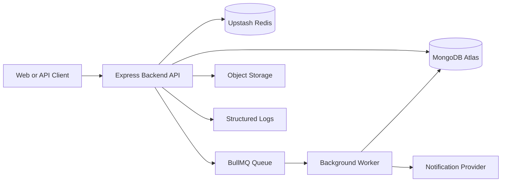

# 01. Project Vision

## Purpose

This document defines the product vision, engineering direction, project boundaries, and success criteria for the Multi-Tenant SaaS Backend.

The project exists to demonstrate production-grade backend engineering using a realistic Node.js, Express, MongoDB, Redis, and BullMQ stack. It should be strong enough for backend interviews, portfolio review, and implementation by another engineer without relying on undocumented assumptions.

The system will be designed as a multi-tenant SaaS support platform where organizations manage users, teams, tickets, comments, attachments, notifications, and audit logs.

## Scope

The project scope is backend architecture documentation for a modular monolith SaaS API.

Included in scope:

- Multi-tenant organization model.
- User management.
- Authentication with JWT access tokens and refresh tokens.
- Role-based access control.
- Tenant isolation.
- Team management.
- Ticket management.
- Ticket comments.
- Attachment metadata handling.
- Notification workflows.
- Audit logging.
- Redis-based caching.
- BullMQ background jobs.
- MongoDB data modeling.
- Swagger/OpenAPI planning.
- Testing strategy.
- Docker-based local infrastructure.
- CI/CD and deployment planning.
- Observability, logging, and health checks.
- Security controls for a production API.

Excluded from scope:

- Frontend application implementation.
- Mobile clients.
- Payment and billing.
- Real-time chat.
- Enterprise SSO.
- Multi-region deployment.
- Microservices.
- Kubernetes.
- Kafka or event mesh architecture.
- GraphQL.
- CQRS or event sourcing.

These exclusions are intentional. The project targets a realistic 0-1 year backend portfolio, not an artificially complex distributed system.

## Product Vision

The product is a backend platform for small and mid-sized SaaS companies that need internal customer-support workflows across multiple organizations.

Each organization acts as a tenant. Users belong to one or more organizations through memberships. Within an organization, users can be assigned roles and participate in teams. Tickets represent work items such as support requests, operational tasks, or customer issues. Comments, attachments, status transitions, notifications, and audit logs provide the supporting workflow.

The backend should make these core workflows reliable:

- A user signs up or logs in securely.
- A user creates or joins an organization.
- Organization administrators invite and manage members.
- Teams group users inside an organization.
- Users create, update, assign, filter, and search tickets.
- Users collaborate through ticket comments.
- Important actions produce audit logs.
- Background jobs handle delayed or external work.
- Redis improves selected read paths without becoming required for core correctness.

## Target Users

Primary users:

- SaaS organization owners.
- Organization administrators.
- Support managers.
- Support agents.
- Internal team members handling operational tickets.

Technical reviewers:

- Backend engineering interviewers.
- MERN stack interviewers.
- Startup CTOs or technical leads.
- Recruiters screening backend portfolio projects.

The system should be understandable to both groups. Product behavior must be clear enough for users, and engineering decisions must be defensible to senior engineers.

## Target Role Alignment

This project is designed for candidates targeting:

- Backend Developer.
- Node.js Developer.
- MERN Stack Developer.
- Full Stack Developer.
- Associate Software Engineer.

The architecture should prove practical backend capability:

- Clean Express architecture.
- Secure authentication and authorization.
- MongoDB schema design and indexing.
- Tenant-aware data access.
- Middleware-driven request handling.
- Background job processing.
- Redis usage with clear invalidation rules.
- Consistent error handling.
- Testing discipline.
- Deployment awareness.
- Honest performance measurement.

The project must not overstate experience. It should show strong fundamentals, not pretend to operate at massive enterprise scale.

## System Boundaries

The backend owns:

- API request validation.
- Authentication and session lifecycle.
- Authorization decisions.
- Tenant context resolution.
- Business workflows.
- Data persistence.
- Audit log creation.
- Background job scheduling.
- Cache read/write behavior.
- API error responses.
- Operational health checks.

External systems own:

- Managed MongoDB hosting.
- Managed Redis hosting.
- Email or notification delivery providers.
- Object storage for uploaded attachment binaries.
- Hosting platform infrastructure.
- Client-side rendering and user interface.

The backend stores attachment metadata but should not store file binaries in MongoDB. File storage belongs in object storage because MongoDB is not the right place for large binary assets in this project.

## Core Business Domains

### Organizations

Organizations are tenants. Every tenant-scoped resource must belong to an organization.

Key responsibilities:

- Organization creation.
- Organization profile management.
- Membership management.
- Tenant-level settings.

### Users

Users represent authenticated people who can belong to organizations.

Key responsibilities:

- Account registration.
- Secure login.
- Password hashing.
- Profile management.
- Membership across organizations.

### Memberships

Memberships connect users to organizations and roles.

Key responsibilities:

- Tenant-scoped access control.
- Role assignment.
- Invitation lifecycle.
- Membership status tracking.

### Teams

Teams group members inside an organization.

Key responsibilities:

- Team creation and updates.
- Member assignment.
- Ticket ownership and routing.

### Tickets

Tickets are the main operational work item.

Key responsibilities:

- Creation.
- Assignment.
- Status changes.
- Priority management.
- Filtering.
- Searching.
- Pagination.
- Soft deletion.

### Comments

Comments support collaboration on tickets.

Key responsibilities:

- Tenant-scoped discussion.
- Author tracking.
- Edit and delete policy.
- Audit-sensitive activity tracking.

### Attachments

Attachments represent files linked to tickets or comments.

Key responsibilities:

- Metadata storage.
- Ownership tracking.
- File type and size validation rules.
- External object storage integration design.

### Notifications

Notifications inform users about relevant events.

Key responsibilities:

- Job scheduling.
- Retry handling.
- Delivery status tracking.
- Failure visibility.

### Audit Logs

Audit logs record security-sensitive and business-critical actions.

Key responsibilities:

- Immutable action history.
- Actor tracking.
- Tenant tracking.
- Request correlation.
- Investigation support.

## High-Level System Context

The API is the central coordination point. MongoDB is the source of truth. Redis improves performance and supports BullMQ but should not hold data that cannot be reconstructed. Workers process deferred tasks that should not block request latency.

## Design Decisions

### Modular Monolith First

The backend will use a modular monolith instead of microservices.

Reasoning:

- The domain is broad but not large enough to justify distributed service boundaries.
- A single deployable API is easier to test, debug, and host.
- Module boundaries can still be clean without operational fragmentation.
- The target role benefits more from strong fundamentals than premature distributed architecture.

### API-First Documentation

API behavior will be documented before implementation.

Reasoning:

- It forces clear request and response contracts.
- It makes validation and error behavior explicit.
- It supports Swagger/OpenAPI generation later.
- It gives interviewers concrete artifacts to inspect.

### Shared Database Multi-Tenancy

The default tenancy model will be a shared MongoDB database with tenant identifiers on tenant-scoped collections.

Reasoning:

- It is cost-effective for a portfolio and free-tier deployment.
- It reflects a common startup SaaS pattern.
- It forces explicit tenant isolation discipline.
- It avoids operational complexity from database-per-tenant provisioning.

### MongoDB as Source of Truth

MongoDB will be the primary data store.

Reasoning:

- The document model fits organizations, tickets, comments, memberships, and audit records.
- MongoDB indexing supports practical query patterns.
- MongoDB Atlas is accessible for deployment.
- The MERN stack alignment is strong for the target roles.

### Redis for Specific Use Cases

Redis will be used only where it has clear value.

Valid use cases:

- Rate limiting counters.
- Cache for selected read-heavy data.
- BullMQ backing store.
- Short-lived verification or invitation tokens if appropriate.

Redis will not replace MongoDB as the source of truth.

### BullMQ for Background Work

BullMQ will handle tasks that should not block API responses.

Valid use cases:

- Notification delivery.
- Retryable external provider calls.
- Cleanup jobs.
- Scheduled reminders or digest notifications.

Business-critical state changes should be persisted before enqueueing dependent jobs.

## Trade-offs

### Simplicity vs. Extensibility

The project favors a modular monolith because it is simpler to deploy and reason about. The trade-off is that future scaling may require extracting modules into services if the product grows substantially.

This is acceptable because clean module boundaries preserve an upgrade path without paying microservice costs too early.

### Shared Database vs. Database Per Tenant

Shared database multi-tenancy reduces cost and operational overhead. The trade-off is that tenant isolation depends heavily on correct query filtering, indexes, middleware, and tests.

This is acceptable because the project will explicitly document tenant-aware repositories, compound indexes, and tenant isolation tests.

### JWT Access Tokens vs. Server-Side Sessions

JWT access tokens reduce database lookups for every authenticated request. The trade-off is that issued access tokens are harder to revoke immediately.

This is acceptable if access tokens are short-lived and refresh tokens are stored, rotated, and revocable.

### Redis Cache vs. Direct Database Reads

Caching can reduce database load and latency for selected endpoints. The trade-off is cache invalidation complexity.

This is acceptable only for data where stale reads are tolerable or invalidation rules are simple.

## Alternatives Considered

### Microservices

Rejected for initial design.

Reason:

- Adds service discovery, distributed tracing, network failure modes, deployment complexity, and data consistency issues.
- Does not match the scale or target experience level.
- Weakens interview defensibility if included without real operational need.

### PostgreSQL Instead of MongoDB

Not selected for this project.

Reason:

- PostgreSQL is strong for relational SaaS data, but the target stack explicitly prioritizes MERN.
- MongoDB better aligns with the intended portfolio positioning.
- MongoDB still requires serious schema design, validation, indexes, and query discipline.

### GraphQL

Rejected for initial design.

Reason:

- REST is simpler, clearer, and more interview-friendly for this backend.
- The product does not require client-driven nested query flexibility.
- REST plus OpenAPI better supports explicit contract documentation.

### Event Sourcing

Rejected.

Reason:

- The project needs audit logs, not full event-sourced state reconstruction.
- Event sourcing would increase implementation and explanation burden without proportional benefit.

### Kafka

Rejected.

Reason:

- BullMQ is enough for background jobs and retryable tasks.
- Kafka is inappropriate for this scale and hosting target.

## Best Practices

The project should follow these practices throughout the documentation and future implementation:

- Keep source code generation blocked until architecture documents are complete.
- Document decisions before implementation.
- Treat MongoDB indexes as part of the design, not an afterthought.
- Enforce tenant isolation at middleware, service, repository, and test levels.
- Use centralized error handling.
- Use consistent API response formats.
- Validate request input before business logic.
- Hash passwords with bcrypt.
- Use short-lived access tokens and rotated refresh tokens.
- Avoid storing secrets in source control.
- Use structured logs with request correlation IDs.
- Prefer idempotent background jobs.
- Measure performance through reproducible tests instead of invented claims.
- Keep deployment realistic for Render, MongoDB Atlas, and Upstash Redis.

## Risks

### Tenant Data Leakage

The highest-risk failure is returning or modifying data from the wrong organization.

Mitigation:

- Require tenant context for all tenant-scoped operations.
- Use compound indexes with `organizationId`.
- Add repository-level tenant filters.
- Add tenant isolation integration tests.
- Avoid accepting tenant IDs blindly from request bodies when they should come from route context or membership context.

### Over-Engineering

The project can lose credibility if it includes patterns that are not justified.

Mitigation:

- Avoid microservices and distributed architecture patterns.
- Keep background jobs focused on real asynchronous tasks.
- Use Redis selectively.
- Explain trade-offs honestly.

### Weak Authorization Boundaries

Authentication alone is not enough. Users must only perform actions allowed by their role in the relevant organization.

Mitigation:

- Define permissions explicitly.
- Centralize RBAC checks.
- Test forbidden paths.
- Separate platform roles from organization roles.

### Inconsistent Error Handling

Mixed error response formats make APIs harder to consume and debug.

Mitigation:

- Define error taxonomy.
- Use centralized error middleware.
- Include request correlation IDs.
- Avoid leaking internal stack traces in production.

### Unmeasured Performance Claims

Portfolio projects often claim scale without evidence.

Mitigation:

- Document how metrics will be measured.
- Use k6 or equivalent load testing later.
- Record test environment details with any benchmark.
- Avoid resume metrics until measurements exist.

## Success Criteria

The documentation phase is successful when:

- Every planned document exists and is internally consistent.
- Major decisions have clear trade-offs and alternatives.
- API behavior can be implemented without guessing.
- Database collections, relationships, constraints, and indexes are defined.
- Auth, RBAC, and tenant isolation rules are testable.
- Deployment architecture is realistic for the selected hosting stack.
- Resume claims can be tied to implemented features or measured evidence.

The implementation phase is successful when:

- The API follows the documented architecture.
- Tenant isolation tests pass.
- Auth and RBAC tests cover allowed and forbidden paths.
- Database indexes match documented query patterns.
- Background jobs are retryable and observable.
- Error responses are consistent.
- Logs include enough context for debugging.
- Deployment works with documented environment variables.

## Future Improvements

Potential future improvements after the core system is complete:

- Billing and subscription management.
- Organization-level usage limits.
- Webhook delivery for external integrations.
- Real-time ticket updates with WebSockets or Server-Sent Events.
- Full-text search with MongoDB Atlas Search.
- Object storage integration with pre-signed upload URLs.
- Admin analytics dashboards.
- More advanced notification preferences.
- SSO with OAuth or SAML.
- Service extraction only if real operational bottlenecks justify it.

These improvements should not be added until the core backend is complete, tested, and deployable.
