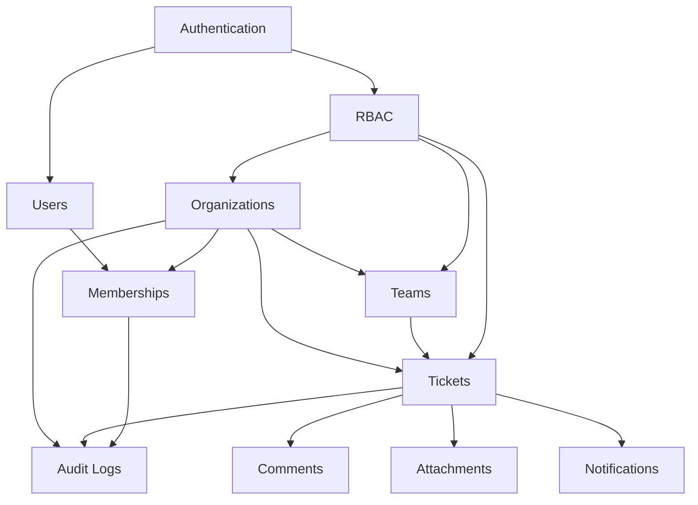

# 02. Functional Requirements

## Purpose

This document defines the functional requirements for the Multi-Tenant SaaS Backend.

Functional requirements describe what the system must do from a business and API behavior perspective. They intentionally avoid implementation details such as Express route handlers, MongoDB schemas, controller code, or service code. Those details will be covered later in architecture, database, API, and implementation planning documents.

## Scope

This document covers required backend capabilities for:

- Authentication.
- Session management.
- User management.
- Organization and tenant management.
- Membership and invitation workflows.
- Role-based access control.
- Team management.
- Ticket management.
- Comment management.
- Attachment metadata management.
- Notification workflows.
- Audit logging.
- Search, filtering, sorting, and pagination.
- Background job behavior.
- Health and operational endpoints.

Out of scope:

- Frontend UI behavior.
- Payment billing flows.
- Enterprise SSO.
- Real-time chat.
- Implementation source code.
- Detailed database schema.
- Complete endpoint-by-endpoint API contracts.

Endpoint-level details will be defined in `09-api-specification.md`.

## Responsibilities

The backend must be responsible for:

- Accepting and validating client requests.
- Authenticating users.
- Authorizing actions using tenant-aware RBAC.
- Enforcing tenant isolation.
- Managing organization-scoped resources.
- Persisting business state.
- Producing audit logs for important actions.
- Scheduling and processing background jobs.
- Returning consistent success and error responses.
- Supporting operational visibility through health checks and structured logs.

The backend must not rely on the client to enforce security-sensitive rules. Client-side checks are usability helpers only.

## Actors

### Anonymous User

An unauthenticated user.

Allowed capabilities:

- Register an account.
- Log in.
- Refresh a session if a valid refresh token exists.
- Request password reset if that feature is enabled.
- Access public health metadata only if exposed intentionally.

### Authenticated User

A user with a valid access token.

Allowed capabilities:

- View their own profile.
- Update safe profile fields.
- View organizations where they are an active member.
- Switch active organization context.
- Perform organization actions allowed by their membership role.
- Log out from the current session.
- Log out from all sessions.

### Organization Owner

The highest authority inside an organization.

Allowed capabilities:

- Manage organization settings.
- Manage all organization members.
- Assign administrative roles.
- Create and manage teams.
- Access all tickets in the organization.
- View audit logs.
- Configure notification preferences where supported.

### Organization Admin

A privileged organization member.

Allowed capabilities:

- Invite and manage most members.
- Create and manage teams.
- Manage tickets across the organization.
- View audit logs if permission is granted.
- Configure selected organization settings.

Restricted capabilities:

- Cannot remove the final owner.
- Cannot assign owner role unless explicitly permitted.
- Cannot access other organizations.

### Manager

A team or support lead.

Allowed capabilities:

- Manage tickets assigned to their teams.
- Assign tickets to team members.
- Update ticket priority and status.
- View team-level activity.
- Add comments and attachments.

### Agent

A regular support or operations user.

Allowed capabilities:

- View assigned or permitted tickets.
- Create tickets if allowed by policy.
- Update tickets assigned to them.
- Add comments.
- Add attachments if permitted.
- Receive notifications.

### System Worker

A trusted background process.

Allowed capabilities:

- Process queued jobs.
- Send notifications.
- Retry failed external calls.
- Run cleanup tasks.
- Mark job outcomes.

System workers must operate with explicit job context and must not bypass tenant isolation rules unless the job is intentionally platform-level.

## Functional Domains

## Authentication Requirements

### Account Registration

The system must allow a new user to create an account using valid credentials.

Required behavior:

- Accept name, email, and password.
- Normalize email before uniqueness checks.
- Reject duplicate active email accounts.
- Validate password strength according to documented policy.
- Hash passwords before storage.
- Create a user account in active or pending-verification state depending on final email verification design.
- Return an authentication result only if the account is allowed to log in immediately.
- Produce an audit event for account registration where appropriate.

Failure cases:

- Invalid email format.
- Weak password.
- Duplicate email.
- Malformed request body.
- Rate limit exceeded.

### Login

The system must allow users to authenticate with email and password.

Required behavior:

- Validate credentials.
- Return a short-lived access token.
- Issue a refresh token using the documented token strategy.
- Track refresh token metadata for revocation and rotation.
- Reject inactive, disabled, or deleted accounts.
- Apply stricter rate limits to login attempts.
- Avoid exposing whether an email exists through error messages.

Failure cases:

- Invalid credentials.
- Disabled account.
- Deleted account.
- Too many attempts.
- Invalid request body.

### Refresh Token Rotation

The system must allow a valid refresh token to obtain a new access token.

Required behavior:

- Validate refresh token authenticity and stored state.
- Rotate refresh tokens on use.
- Revoke the previous refresh token after successful rotation.
- Detect reuse of an already rotated or revoked token.
- Revoke affected token family on suspected reuse.
- Return a new short-lived access token.

Failure cases:

- Missing refresh token.
- Expired refresh token.
- Revoked refresh token.
- Reused refresh token.
- Token does not match stored hash.

### Logout

The system must support logout from the current session.

Required behavior:

- Revoke the current refresh token.
- Clear refresh token cookie if cookie storage is used.
- Leave other sessions active unless the user requests global logout.

### Logout From All Sessions

The system must support revoking all active sessions for the authenticated user.

Required behavior:

- Revoke every active refresh token for the user.
- Make future refresh attempts fail.
- Preserve audit trail for session revocation.

### Password Reset

Password reset is optional for the first implementation phase but should be designed as a supported future workflow.

Required behavior when implemented:

- Generate a short-lived reset token.
- Store only a hashed reset token.
- Deliver reset instructions through a background notification job.
- Invalidate existing sessions after successful password reset.
- Rate-limit reset requests.
- Avoid revealing account existence.

## User Management Requirements

### View Own Profile

Authenticated users must be able to view their own account profile.

Returned data must exclude:

- Password hash.
- Refresh token data.
- Internal security metadata.
- Sensitive provider details.

### Update Own Profile

Authenticated users must be able to update safe profile fields.

Allowed fields may include:

- Display name.
- Avatar metadata.
- Timezone.
- Notification preferences.

Restricted fields:

- Role.
- Organization memberships.
- Email verification state.
- Password hash.
- Account status.

### Change Password

Authenticated users must be able to change their password.

Required behavior:

- Require current password.
- Validate new password strength.
- Hash the new password.
- Revoke existing refresh tokens except the current session or all sessions depending on security policy.
- Produce an audit log.

## Organization Requirements

### Create Organization

Authenticated users must be able to create an organization.

Required behavior:

- Validate organization name and slug.
- Ensure slug uniqueness.
- Create the organization.
- Assign the creator as organization owner.
- Create initial membership atomically with organization creation.
- Produce an audit log.

Failure cases:

- Duplicate slug.
- Invalid organization name.
- Authenticated user not eligible to create organizations.

### View Organizations

Authenticated users must be able to list organizations where they have active membership.

Required behavior:

- Return only organizations the user belongs to.
- Include membership role and membership status.
- Exclude organizations where membership is removed, expired, or rejected.

### View Organization Details

Organization members must be able to view organization details if their role permits.

Required behavior:

- Enforce membership.
- Return tenant metadata safe for the requesting role.
- Exclude internal billing or security fields unless explicitly authorized.

### Update Organization

Authorized organization users must be able to update organization settings.

Required behavior:

- Validate update fields.
- Restrict slug changes or treat them as privileged operations.
- Produce an audit log.
- Prevent updates by users without appropriate permissions.

### Deactivate Organization

Organization owners must be able to deactivate an organization.

Required behavior:

- Mark organization as inactive.
- Prevent normal tenant operations after deactivation.
- Preserve data for audit and recovery.
- Revoke or block memberships if required by policy.
- Produce an audit log.

Hard deletion should not be part of normal user-facing behavior.

## Membership and Invitation Requirements

### Invite Member

Authorized users must be able to invite users to an organization.

Required behavior:

- Accept invitee email and intended role.
- Validate inviter permission.
- Prevent duplicate active memberships.
- Prevent duplicate pending invitations where appropriate.
- Generate an invitation token or invitation record.
- Set invitation expiration.
- Queue notification delivery.
- Produce an audit log.

### Accept Invitation

Invited users must be able to accept an invitation.

Required behavior:

- Validate invitation token.
- Confirm invitation has not expired.
- Create or activate membership.
- Link to an existing user account or complete account creation depending on flow.
- Mark invitation as accepted.
- Produce an audit log.

### Revoke Invitation

Authorized users must be able to revoke pending invitations.

Required behavior:

- Validate organization permission.
- Mark invitation as revoked.
- Prevent future acceptance.
- Produce an audit log.

### List Members

Authorized organization users must be able to list members.

Required behavior:

- Support pagination.
- Support filtering by role, status, team, and search text.
- Return role and membership status.
- Exclude security-sensitive user fields.

### Update Member Role

Authorized users must be able to update another member's role.

Required behavior:

- Enforce role hierarchy.
- Prevent users from escalating themselves unless explicitly allowed.
- Prevent removing or demoting the final owner.
- Produce an audit log.

### Remove Member

Authorized users must be able to remove a member from an organization.

Required behavior:

- Mark membership as removed instead of hard deleting.
- Reassign or unassign owned tickets according to documented policy.
- Prevent removing the final owner.
- Produce an audit log.

## RBAC Requirements

The system must enforce role-based access control for every protected operation.

Required behavior:

- Define roles separately from permissions.
- Resolve permissions in the context of the active organization.
- Support platform-level and organization-level permission distinction.
- Deny access by default.
- Apply authorization after authentication and tenant resolution.
- Return consistent forbidden responses.

Minimum organization roles:

- Owner.
- Admin.
- Manager.
- Agent.
- Viewer, if read-only access is useful.

The exact permission matrix will be defined in `11-rbac-design.md`.

## Tenant Isolation Requirements

The system must isolate all tenant-scoped data by organization.

Required behavior:

- Every tenant-scoped operation must resolve an organization context.
- Users must have active membership in the organization context.
- Queries for tenant-scoped resources must include organization filtering.
- Background jobs must include organization context when processing tenant data.
- Audit logs must include organization context when applicable.
- Tests must prove users cannot access data across organizations.

Tenant isolation must not rely on client-provided organization IDs alone. The backend must verify membership and permissions server-side.

## Team Requirements

### Create Team

Authorized users must be able to create teams inside an organization.

Required behavior:

- Validate team name.
- Ensure team name uniqueness within an organization if required.
- Assign optional team manager.
- Produce an audit log.

### Update Team

Authorized users must be able to update team metadata.

Required behavior:

- Validate updates.
- Preserve organization ownership.
- Prevent unauthorized role changes.
- Produce an audit log.

### Add Team Member

Authorized users must be able to add organization members to teams.

Required behavior:

- Confirm user is an active organization member.
- Prevent adding users from another organization.
- Avoid duplicate team membership.
- Produce an audit log.

### Remove Team Member

Authorized users must be able to remove members from teams.

Required behavior:

- Preserve organization membership.
- Update ticket assignment policy where needed.
- Produce an audit log.

### List Teams

Organization users must be able to list teams they are allowed to view.

Required behavior:

- Support pagination.
- Support basic search by team name.
- Include member counts where practical.

## Ticket Requirements

### Create Ticket

Authorized users must be able to create tickets inside an organization.

Required behavior:

- Validate title, description, priority, category, and optional assignment.
- Assign ticket to organization.
- Support assignment to a team or user if authorized.
- Set initial status.
- Create audit activity.
- Queue notifications for relevant users where configured.

### View Ticket

Authorized users must be able to view a ticket if their role and scope allow it.

Required behavior:

- Enforce organization membership.
- Enforce ticket visibility rules.
- Include safe related data such as assignee, team, status, priority, and comment count.
- Exclude internal metadata not needed by clients.

### List Tickets

Authorized users must be able to list tickets within their allowed scope.

Required behavior:

- Support pagination.
- Support sorting by created date, updated date, priority, and status where indexed.
- Support filtering by status, priority, assignee, team, creator, and date range.
- Support search by title or identifier.
- Enforce tenant isolation.
- Return stable pagination metadata.

### Update Ticket

Authorized users must be able to update ticket fields allowed by their permissions.

Required behavior:

- Validate status transitions.
- Validate assignment target.
- Prevent cross-organization assignment.
- Produce audit logs for important changes.
- Queue notifications for assignment or status changes.

### Assign Ticket

Authorized users must be able to assign tickets to users or teams.

Required behavior:

- Confirm assignee belongs to the same organization.
- Confirm assignee is active.
- Confirm team belongs to the same organization.
- Produce audit log.
- Notify affected users.

### Change Ticket Status

Authorized users must be able to move tickets through defined statuses.

Required behavior:

- Validate allowed status transition.
- Record who changed the status.
- Record when the status changed.
- Produce audit log.
- Notify relevant users where configured.

Suggested statuses:

- Open.
- In Progress.
- Waiting.
- Resolved.
- Closed.

### Delete Ticket

Authorized users must be able to soft delete tickets.

Required behavior:

- Mark ticket as deleted.
- Preserve audit trail.
- Hide deleted tickets from normal list results.
- Restrict restore behavior to privileged users if supported.

Hard deletion should be reserved for administrative cleanup or retention-policy workflows.

## Comment Requirements

### Add Comment

Authorized users must be able to add comments to tickets they can access.

Required behavior:

- Validate comment body.
- Associate comment with ticket, organization, and author.
- Prevent comments on deleted or closed tickets depending on policy.
- Produce ticket activity.
- Queue notifications for watchers or assigned users.

### Update Comment

Comment authors or privileged users must be able to update comments.

Required behavior:

- Validate edit permissions.
- Preserve edited metadata.
- Consider storing previous content in audit logs only if required.
- Prevent editing comments across tenants.

### Delete Comment

Comment authors or privileged users must be able to soft delete comments.

Required behavior:

- Preserve comment identity and audit context.
- Hide deleted comment body from normal clients if policy requires.
- Produce audit log for privileged deletions.

### List Comments

Authorized users must be able to list comments for a ticket.

Required behavior:

- Enforce access to parent ticket.
- Support pagination.
- Return comments in stable chronological order.

## Attachment Requirements

### Add Attachment Metadata

Authorized users must be able to attach file metadata to tickets or comments.

Required behavior:

- Validate file name, MIME type, size, and target resource.
- Enforce allowed file types and max size policy.
- Store metadata only.
- Link attachment to organization and parent resource.
- Produce audit activity.

### View Attachment Metadata

Authorized users must be able to view attachment metadata if they can access the parent resource.

Required behavior:

- Enforce tenant isolation.
- Enforce parent ticket or comment access.
- Exclude internal storage provider secrets.

### Delete Attachment Metadata

Authorized users must be able to soft delete attachment metadata.

Required behavior:

- Enforce ownership or privileged permission.
- Preserve audit log.
- Schedule external file cleanup if object storage is integrated.

## Notification Requirements

### Notification Events

The system must create notification work for relevant business events.

Initial notification triggers:

- Member invited.
- Ticket assigned.
- Ticket status changed.
- Comment added to assigned or watched ticket.
- Password reset requested if implemented.

### Notification Delivery

Notifications must be processed asynchronously.

Required behavior:

- Create durable job records through the queue mechanism.
- Retry transient failures.
- Mark failed jobs for inspection after retry exhaustion.
- Avoid blocking API responses on external notification providers.
- Include tenant and recipient context in job payloads.

### Notification Preferences

Users should be able to control basic notification preferences.

Required behavior:

- Store preference choices per user, and per organization if needed.
- Respect opt-out rules except for security-critical notifications.

## Audit Log Requirements

The system must record audit logs for security-sensitive and business-critical actions.

Events requiring audit logs:

- Account registration.
- Login failure threshold reached.
- Password changed.
- Organization created.
- Organization updated.
- Organization deactivated.
- Member invited.
- Invitation accepted.
- Invitation revoked.
- Member role changed.
- Member removed.
- Team created or updated.
- Ticket created.
- Ticket assigned.
- Ticket status changed.
- Ticket deleted.
- Privileged comment deletion.
- Attachment deletion.
- Refresh token reuse detected.

Audit log entries must include:

- Actor.
- Organization context where applicable.
- Action.
- Target resource type.
- Target resource ID.
- Timestamp.
- Request correlation ID.
- Relevant metadata.

Audit logs should be append-only from normal application workflows.

## Search, Filtering, Sorting, and Pagination Requirements

List endpoints must support predictable query behavior.

Required behavior:

- Use pagination for potentially large lists.
- Define maximum page size.
- Use stable sort fields.
- Validate filter values.
- Ignore or reject unsupported filter fields consistently.
- Ensure filters are backed by appropriate indexes later.

Search behavior:

- Ticket search should initially support title or ticket identifier.
- Member search should support name or email where permitted.
- Team search should support team name.

Search must be scoped to the active organization for tenant-scoped resources.

## Background Job Requirements

The system must use background jobs for work that is slow, retryable, scheduled, or dependent on external providers.

Required job categories:

- Notification delivery.
- Invitation email delivery.
- Password reset delivery if implemented.
- Cleanup of expired invitations or tokens.
- Attachment cleanup if object storage is integrated.

Required behavior:

- Jobs must be idempotent where practical.
- Jobs must include enough context for observability.
- Failed jobs must be inspectable.
- Retried jobs must not duplicate business-critical side effects.
- Workers must handle graceful shutdown.

## Operational Requirements

### Health Checks

The backend must expose health information for deployment and monitoring.

Required behavior:

- Basic liveness check.
- Readiness check that verifies critical dependencies where appropriate.
- Separate expensive dependency checks from lightweight liveness checks.

### API Documentation

The backend must expose or generate Swagger/OpenAPI documentation after API contracts are defined.

Required behavior:

- Document authentication requirements.
- Document request bodies.
- Document response bodies.
- Document validation failures.
- Document authorization failures.
- Document common error format.

### Consistent Error Responses

All API failures must follow a consistent error response structure.

Required behavior:

- Include machine-readable error code.
- Include human-readable message.
- Include request correlation ID.
- Include field-level validation details when applicable.
- Avoid leaking stack traces in production.

## Design Decisions

### Requirements Before API Contracts

Functional requirements are documented before endpoint specifications.

Reasoning:

- Requirements define what the system must support.
- API contracts should be derived from workflows instead of invented endpoint-by-endpoint.
- This reduces missing workflows and inconsistent permissions later.

### Soft Delete for Business Records

Tickets, comments, attachments, memberships, and organizations should use soft deletion or status-based deactivation for normal workflows.

Reasoning:

- Supports auditability.
- Prevents accidental data loss.
- Preserves historical ticket context.
- Makes portfolio security and compliance discussions stronger.

### Asynchronous Notifications

Notifications should be handled through background jobs.

Reasoning:

- External providers can be slow or unavailable.
- API response latency should not depend on notification delivery.
- Retries need durable job state.

### Tenant-Scoped Requirements

Most business requirements are scoped by organization.

Reasoning:

- Tenant isolation is the central SaaS design concern.
- Requirements must make cross-tenant access impossible by default.
- API, database, and tests can derive clear rules from this requirement.

## Trade-offs

### Broad Feature Set vs. Implementation Risk

The system includes many realistic SaaS backend features. The trade-off is implementation complexity.

Mitigation:

- Implement in phases.
- Build authentication, tenant context, and RBAC before ticket workflows.
- Keep optional features out of the first implementation milestone.

### Auditability vs. Storage Growth

Audit logs and soft deletes increase storage usage.

Mitigation:

- Use indexes carefully.
- Define retention policies later.
- Avoid logging sensitive payloads.

### Flexible Roles vs. Simpler Authorization

A permission-based RBAC model is more flexible than hard-coded role checks. The trade-off is that permission design requires discipline.

Mitigation:

- Define a clear permission matrix.
- Deny by default.
- Keep initial roles small and understandable.

### Search Capability vs. Query Complexity

Search improves usability but can create inefficient queries if designed casually.

Mitigation:

- Start with constrained search fields.
- Scope all search to organization.
- Add indexes before implementation.
- Consider MongoDB Atlas Search only as a future improvement.

## Alternatives Considered

### Building Tickets Only

Rejected.

Reason:

- A ticket-only backend would be too narrow for a strong backend portfolio.
- It would not sufficiently demonstrate authentication, tenant isolation, RBAC, jobs, caching, and audit design.

### Adding Billing in Version One

Rejected.

Reason:

- Billing adds provider-specific complexity.
- It distracts from core backend fundamentals.
- It is valuable later, after tenancy and RBAC are stable.

### Real-Time Collaboration in Version One

Rejected.

Reason:

- WebSockets add connection management and scaling concerns.
- Ticket and notification workflows can be strong without real-time transport.
- Real-time updates are a future improvement, not a core requirement.

### Hard Deletion for Simplicity

Rejected for normal business records.

Reason:

- Hard deletion weakens auditability.
- It makes debugging and interview defense harder.
- Soft deletion is more realistic for tenant-scoped business systems.

## Best Practices

Functional requirements should follow these standards:

- Every protected action must require authentication.
- Every tenant-scoped action must require active organization membership.
- Every privileged action must require explicit permission.
- Every list operation must define pagination.
- Every search operation must be tenant-scoped.
- Every important state change should produce an audit log.
- Every external side effect should be asynchronous where practical.
- Every optional feature must be separated from core requirements.
- Every requirement should be testable.
- The backend must never trust the client for authorization or tenant isolation.

## Risks

### Requirement Creep

The project can expand beyond a realistic portfolio scope.

Mitigation:

- Keep billing, SSO, real-time collaboration, and analytics as future improvements.
- Prioritize core SaaS workflows first.

### Incomplete Authorization Requirements

Missing permission rules can cause insecure implementation later.

Mitigation:

- Define all roles and permissions in `11-rbac-design.md`.
- Treat forbidden cases as required test cases.

### Tenant Isolation Gaps

Any requirement that does not explicitly mention organization context may be implemented incorrectly.

Mitigation:

- Classify each resource as platform-scoped, user-scoped, or tenant-scoped.
- Require organization context for tenant-scoped resources.

### Background Job Duplication

Retries can duplicate notifications or side effects.

Mitigation:

- Require idempotency keys where needed.
- Store delivery attempts.
- Make job handlers safe to retry.

### Unbounded Queries

List endpoints without pagination can degrade performance.

Mitigation:

- Require pagination for all large collections.
- Define max page size.
- Back filters with indexes.

## Future Improvements

Potential functional improvements after core implementation:

- Billing and subscription management.
- Organization usage limits.
- Webhook subscriptions for external integrations.
- Real-time ticket updates.
- Advanced reporting and analytics.
- Customer-facing ticket portal.
- SLA tracking.
- Ticket watchers and follower preferences.
- Custom organization roles.
- SSO integration.
- Full-text search with MongoDB Atlas Search.

These should be deferred until the core workflows are implemented, tested, and deployed.
