# 04. Domain Model

## Purpose

This document defines the business domain model for the Multi-Tenant SaaS Backend.

It bridges requirements engineering and system architecture by explaining the business concepts, ownership rules, relationships, invariants, lifecycles, and domain events before technical implementation decisions are finalized. The system architecture should be derived from this model, not the other way around.

## Scope

This document covers:

- Ubiquitous language usage.
- Business domains and boundaries.
- Aggregate roots.
- Entities.
- Value objects.
- Domain relationships.
- Ownership rules.
- Business invariants.
- Entity lifecycles.
- Domain events.
- Business rules.
- Domain constraints.
- Domain risks and future extensions.

Out of scope:

- Express routes.
- Controllers.
- MongoDB schemas.
- API endpoint contracts.
- Repository method design.
- Queue implementation.
- Cache key implementation.

Those details belong in later technical architecture documents.

## Why Domain Modeling Matters

Domain modeling defines what the business is before deciding how the backend should be built.

This improves maintainability because modules can follow real business boundaries instead of arbitrary technical groupings. It improves communication because engineers, reviewers, and interviewers can use the same vocabulary. It improves database design because persistence structures can be derived from ownership, lifecycle, and consistency rules. It improves API consistency because endpoints can expose stable business concepts rather than leaking storage details. It improves testing because business invariants become explicit test cases. It improves long-term scalability because boundaries can evolve deliberately instead of being discovered through production defects.

For this project, domain modeling is especially important because multi-tenant SaaS systems fail when ownership and isolation rules are vague. A ticket, comment, attachment, team, membership, notification, and audit log must all have clear tenant ownership before database design, authorization, caching, and background jobs are finalized.

## Ubiquitous Language

The official terminology source is `00-glossary.md`.

This document uses those terms consistently and does not redefine them. Important terms include:

- Tenant.
- Organization.
- User.
- Member.
- Membership.
- Role.
- Permission.
- Team.
- Ticket.
- Comment.
- Attachment.
- Notification.
- Audit Log.
- Session.
- Access Token.
- Refresh Token.
- Worker.
- Job.

Any future document that introduces new business terminology must update `00-glossary.md` first.

## Domain Map

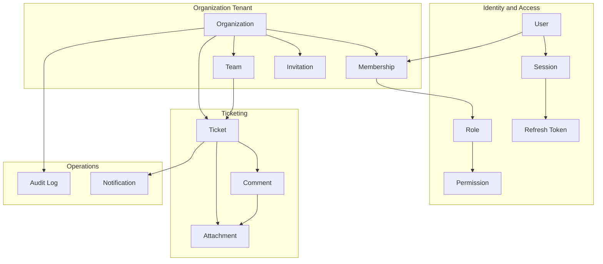

## Business Domains

### Authentication

Authentication proves the identity of a user.

Core concepts:

- User.
- Session.
- Refresh Token.
- Access Token.
- Password credential.

Boundary:

- Authentication owns login, logout, token rotation, password verification, and session revocation.
- Authentication does not decide tenant permissions.

### Authorization

Authorization decides whether an authenticated actor may perform an action.

Core concepts:

- Role.
- Permission.
- Membership.
- Organization context.

Boundary:

- Authorization owns permission evaluation.
- Tenant-scoped authorization depends on active membership.

### Organizations

Organizations are tenants and business workspaces.

Core concepts:

- Organization.
- Organization settings.
- Organization lifecycle.

Boundary:

- Organizations own tenant-level identity, lifecycle, settings, and tenant-scoped resource ownership.

### Users

Users represent account-level identity.

Core concepts:

- User profile.
- Account status.
- Security state.

Boundary:

- Users own account profile and identity.
- Organization-specific privileges belong to memberships, not directly to users.

### Memberships

Memberships connect users to organizations.

Core concepts:

- Member.
- Role.
- Membership status.
- Invitation.

Boundary:

- Memberships own the relationship between user and organization.
- Memberships are the core authorization bridge for tenant-scoped access.

### Teams

Teams group members inside an organization.

Core concepts:

- Team.
- Team membership.
- Team manager.

Boundary:

- Teams own internal grouping for ticket routing and operational responsibility.
- Teams cannot contain members from another organization.

### Tickets

Tickets are the main operational work item.

Core concepts:

- Ticket.
- Assignment.
- Status.
- Priority.
- Ticket activity.

Boundary:

- Tickets own workflow state, assignment, and collaboration context.

### Comments

Comments represent ticket discussion.

Core concepts:

- Comment.
- Author.
- Edit state.
- Soft deletion state.

Boundary:

- Comments belong to tickets and cannot exist independently.

### Attachments

Attachments represent file metadata linked to tickets or comments.

Core concepts:

- Attachment metadata.
- Parent resource.
- Storage reference.

Boundary:

- Attachments own metadata only.
- File binary storage belongs to external object storage.

### Notifications

Notifications represent user-facing communication triggered by business events.

Core concepts:

- Notification.
- Recipient.
- Delivery status.
- Delivery attempt.

Boundary:

- Notifications own delivery intent and status.
- External providers own actual delivery transport.

### Audit Logs

Audit logs represent security-sensitive and business-critical history.

Core concepts:

- Audit Log.
- Actor.
- Action.
- Target.
- Correlation ID.

Boundary:

- Audit logs record events; they do not enforce business rules.

### Sessions

Sessions represent authenticated login state.

Core concepts:

- Session.
- Refresh Token.
- Token family.

Boundary:

- Sessions own refresh token lifecycle and revocation behavior.

## Aggregate Roots

| Aggregate Root | Why It Is an Aggregate Root |
|---|---|
| Organization | Owns tenant lifecycle and acts as the consistency boundary for tenant-scoped resources. |
| User | Owns account identity, profile, and authentication relationship. |
| Membership | Owns the relationship between a user and organization, including role and status. |
| Invitation | Owns pending membership admission lifecycle. |
| Team | Owns team identity and member grouping inside one organization. |
| Ticket | Owns ticket workflow, assignment, comments, and attachment association. |
| Session | Owns refresh token family and session revocation lifecycle. |
| Notification | Owns delivery intent, status, and retry outcome. |
| Audit Log | Owns immutable record of an important action. |

Comments are not aggregate roots because they cannot exist without a ticket. Attachments are not aggregate roots because they are owned by a ticket or comment context. Refresh tokens are not aggregate roots because they belong to a session.

## Entities

### Organization

Purpose:

- Represents a tenant and workspace.

Responsibilities:

- Own tenant identity, slug, settings, and lifecycle state.
- Serve as the root ownership boundary for tenant-scoped records.

Ownership:

- Owns memberships, invitations, teams, tickets, notifications, and audit logs.

Lifecycle:

- Draft or created.
- Active.
- Suspended or deactivated.
- Soft deleted if retention policy requires.

Relationships:

- One organization has many memberships.
- One organization has many teams.
- One organization has many tickets.
- One organization has many audit logs.

Constraints:

- Organization slug must be unique.
- Deactivated organizations cannot create new tenant-scoped work.
- At least one owner must exist for an active organization.

### User

Purpose:

- Represents a person with account-level identity.

Responsibilities:

- Own profile data, credential state, and account lifecycle.

Ownership:

- Owns sessions.
- Participates in organizations through memberships.

Lifecycle:

- Registered.
- Active.
- Suspended.
- Deleted or anonymized.

Relationships:

- One user can have many memberships.
- One user can have many sessions.
- One user can author tickets and comments.

Constraints:

- Email must be normalized for uniqueness.
- Password hash must never be exposed.
- Deleted or disabled users cannot create new sessions.

### Membership

Purpose:

- Connects one user to one organization.

Responsibilities:

- Store member role, status, and tenant access relationship.

Ownership:

- Owned by an organization.
- References one user.

Lifecycle:

- Pending.
- Active.
- Suspended.
- Removed.

Relationships:

- Many memberships can belong to one organization.
- Many memberships can reference one user.
- Memberships may participate in teams.

Constraints:

- One active membership per user per organization.
- Only active memberships grant permissions.
- The final owner membership cannot be removed or demoted.

### Invitation

Purpose:

- Represents a pending request to join an organization.

Responsibilities:

- Store invitee email, intended role, expiration, and acceptance state.

Ownership:

- Owned by an organization.

Lifecycle:

- Pending.
- Accepted.
- Revoked.
- Expired.

Relationships:

- Invitation may become a membership.
- Invitation is created by an existing authorized member.

Constraints:

- Expired or revoked invitations cannot be accepted.
- Duplicate pending invitations for the same email and organization should be prevented or explicitly replaced.

### Team

Purpose:

- Groups members inside an organization.

Responsibilities:

- Support ticket routing, responsibility assignment, and team-scoped visibility.

Ownership:

- Owned by an organization.

Lifecycle:

- Active.
- Archived.
- Deleted.

Relationships:

- One team belongs to one organization.
- One team has many memberships.
- One ticket may be assigned to one team.

Constraints:

- Team members must belong to the same organization.
- Team names may be unique within an organization if required by UX and API design.

### Ticket

Purpose:

- Represents the primary work item.

Responsibilities:

- Own title, description, status, priority, assignment, lifecycle, comments, and attachment context.

Ownership:

- Owned by an organization.

Lifecycle:

- Open.
- In Progress.
- Waiting.
- Resolved.
- Closed.
- Deleted.

Relationships:

- One ticket belongs to one organization.
- One ticket may be assigned to one user or one team.
- One ticket has many comments.
- One ticket has many attachments.

Constraints:

- Ticket assignment targets must belong to the same organization.
- Closed tickets cannot be reassigned unless explicitly reopened or privileged policy allows it.
- Deleted tickets are hidden from normal list results.

### Comment

Purpose:

- Represents discussion on a ticket.

Responsibilities:

- Store author, body, edit state, deletion state, and ticket association.

Ownership:

- Owned by a ticket.

Lifecycle:

- Active.
- Edited.
- Deleted.

Relationships:

- One comment belongs to one ticket.
- One comment has one author.
- One comment may have attachments.

Constraints:

- Comments cannot exist without a ticket.
- Comment author must have access to the parent ticket.
- Deleted comments should preserve audit context.

### Attachment

Purpose:

- Represents file metadata linked to a ticket or comment.

Responsibilities:

- Store filename, MIME type, size, storage reference, parent resource, and deletion state.

Ownership:

- Owned by a ticket or comment context.

Lifecycle:

- Pending upload.
- Active.
- Deleted.
- Orphaned cleanup pending.

Relationships:

- One attachment belongs to one organization through its parent resource.
- One attachment belongs to either a ticket or a comment.

Constraints:

- Attachment parent must be accessible by the actor.
- File size and MIME type must satisfy policy.
- MongoDB stores metadata only, not file binaries.

### Session

Purpose:

- Represents a user's authenticated login session.

Responsibilities:

- Own refresh token family, revocation state, and session metadata.

Ownership:

- Owned by a user.

Lifecycle:

- Active.
- Revoked.
- Expired.
- Compromised.

Relationships:

- One session belongs to one user.
- One session has many refresh tokens over time.

Constraints:

- Revoked sessions cannot refresh access tokens.
- Suspicious token reuse should revoke the affected token family.

### Refresh Token

Purpose:

- Allows a session to obtain a new access token.

Responsibilities:

- Track token rotation, expiration, revocation, and reuse detection.

Ownership:

- Owned by a session.

Lifecycle:

- Active.
- Rotated.
- Revoked.
- Expired.
- Reuse Detected.

Relationships:

- One refresh token belongs to one session.
- Refresh tokens form a token family.

Constraints:

- Refresh tokens should be stored hashed.
- A rotated token cannot be reused.
- Reuse detection should revoke the token family.

### Notification

Purpose:

- Represents a delivery intent to inform a user about an event.

Responsibilities:

- Track recipient, channel, status, attempts, and delivery result.

Ownership:

- Owned by an organization when tenant-scoped.
- References one recipient user.

Lifecycle:

- Pending.
- Queued.
- Sent.
- Failed.
- Cancelled.

Relationships:

- Notification may reference a ticket, comment, invitation, or security event.

Constraints:

- Tenant-scoped notifications must include organization context.
- Security-critical notifications may ignore opt-out preferences.

### Audit Log

Purpose:

- Records important security and business actions.

Responsibilities:

- Preserve actor, action, target, timestamp, organization context, and correlation ID.

Ownership:

- Owned by an organization when tenant-scoped.
- Platform-owned when account-level or system-level.

Lifecycle:

- Created.
- Retained.
- Archived by retention policy if implemented.

Relationships:

- References actor and target resource.

Constraints:

- Audit logs should be append-only from normal application workflows.
- Audit logs must not store secrets or raw sensitive payloads.

## Value Objects

| Value Object | Why It Is a Value Object |
|---|---|
| Email Address | Identified by normalized value, not independent identity. |
| Organization Slug | Immutable or controlled string value used for tenant identity and routing. |
| Display Name | Descriptive value without independent lifecycle. |
| Role Name | Named value mapped to permissions. |
| Permission Key | Stable string representing an allowed action. |
| Ticket Status | Enumerated workflow value. |
| Ticket Priority | Enumerated ordering or urgency value. |
| Pagination Parameters | Request value object controlling page size, cursor, and sort. |
| Date Range | Filter value for time-bound queries. |
| File Metadata | Filename, MIME type, size, checksum, and storage key values. |
| Correlation ID | Trace identifier value propagated across requests and jobs. |
| Token Fingerprint | Hashed or derived token identifier used for lookup and audit. |

Value objects do not require global identity. They are validated, compared, and replaced by value.

## Domain Relationships

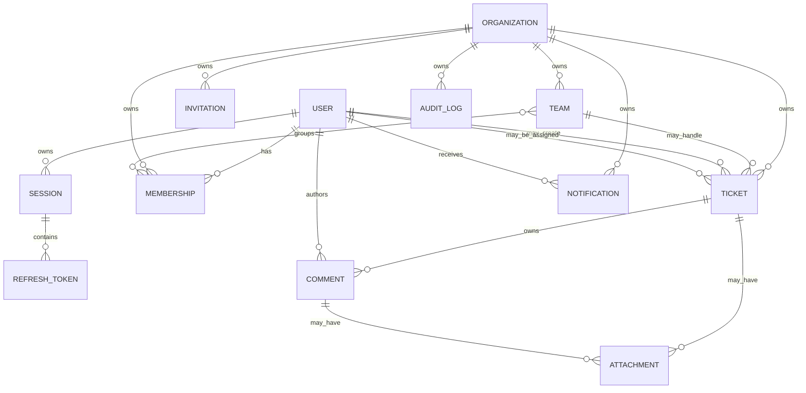

Relationship categories:

- One-to-one: A refresh token belongs to exactly one session.
- One-to-many: One organization owns many tickets.
- Many-to-many: Users and organizations relate through memberships.
- Ownership: Organization owns tenant-scoped records.
- Composition: Ticket owns comments because comments cannot exist independently.
- Aggregation: Team groups memberships but does not own user accounts.

## Domain Ownership Rules

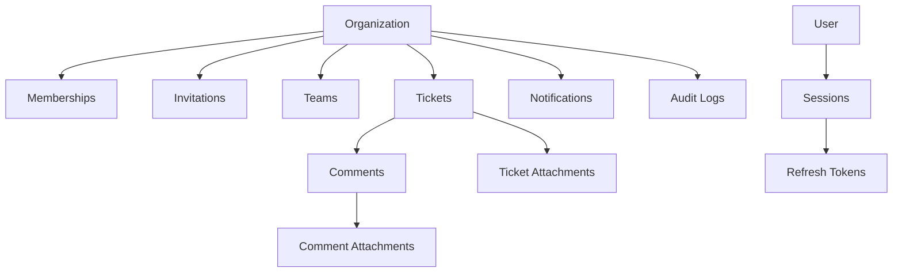

Ownership rules:

- Organization owns memberships because tenant access is organization-scoped.
- Organization owns invitations because invitations grant access to one organization.
- Organization owns teams because teams cannot span tenants.
- Organization owns tickets because tickets are tenant-scoped work items.
- Organization owns tenant-scoped notifications because delivery context depends on tenant activity.
- Organization owns tenant-scoped audit logs because audit history is part of tenant history.
- User owns sessions because sessions authenticate a user account.
- Session owns refresh tokens because refresh token lifecycle belongs to a login session.
- Ticket owns comments because comments cannot exist without the ticket.
- Ticket owns ticket-level attachments.
- Comment owns comment-level attachments, while the parent ticket still controls access.

## Business Invariants

- A ticket always belongs to exactly one organization.
- A team always belongs to exactly one organization.
- A membership always belongs to exactly one user and one organization.
- A user can have only one active membership per organization.
- Only active memberships grant organization permissions.
- An active organization must have at least one owner.
- The last owner cannot be removed, suspended, or demoted.
- A team cannot contain users from another organization.
- A ticket assignee must be an active member of the same organization.
- A ticket team assignment must reference a team in the same organization.
- Comments cannot exist without a ticket.
- Attachments cannot exist without a ticket or comment parent.
- A comment author must have access to the parent ticket at creation time.
- A refresh token belongs to exactly one session.
- A session belongs to exactly one user.
- A rotated refresh token cannot be used again.
- A revoked session cannot issue new access tokens.
- Deleted organizations cannot create new teams, tickets, comments, attachments, invitations, or notifications.
- Closed tickets cannot be reassigned unless reopened or overridden by privileged policy.
- Soft-deleted tickets are excluded from normal listing results.
- Audit logs must not contain plaintext passwords, access tokens, refresh tokens, or secrets.

## Entity Lifecycles

### Organization Lifecycle

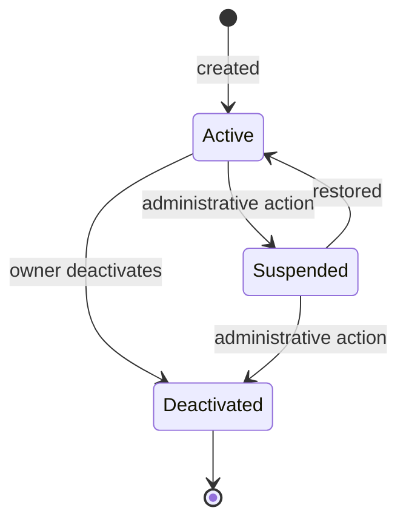

### Membership Lifecycle

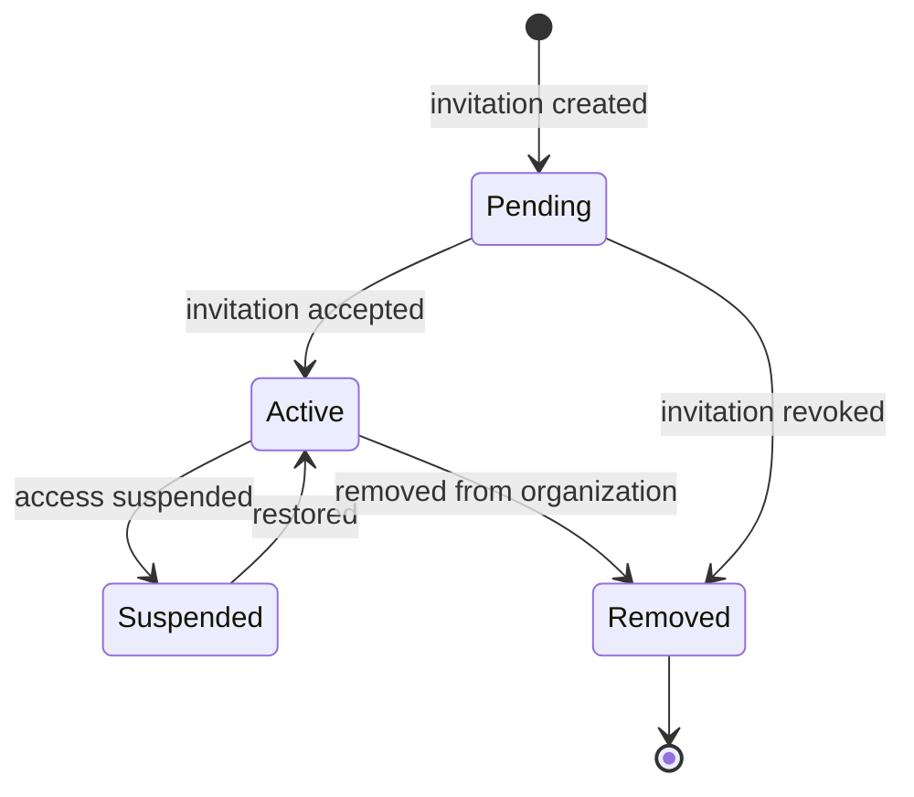

### User Account Lifecycle

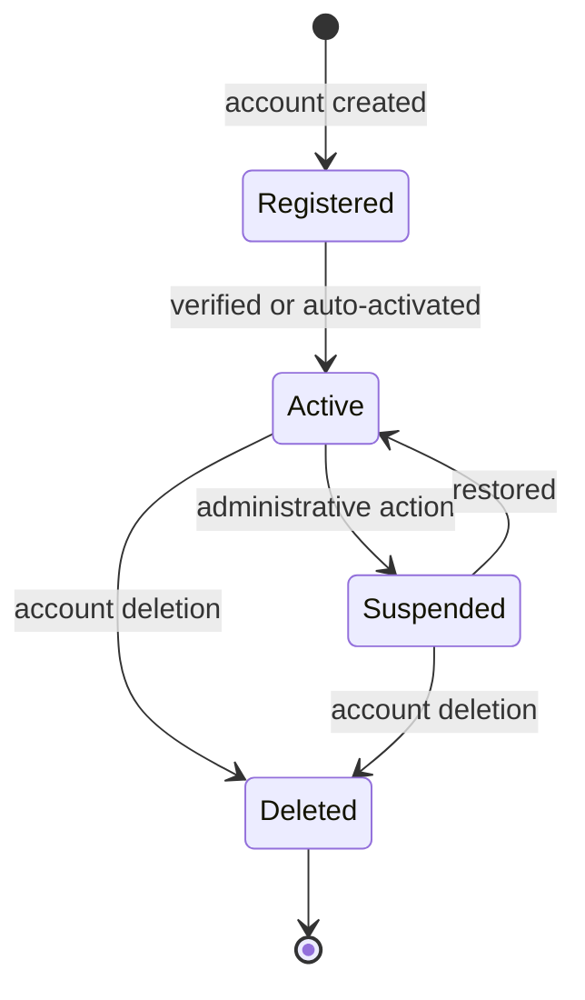

### Ticket Lifecycle

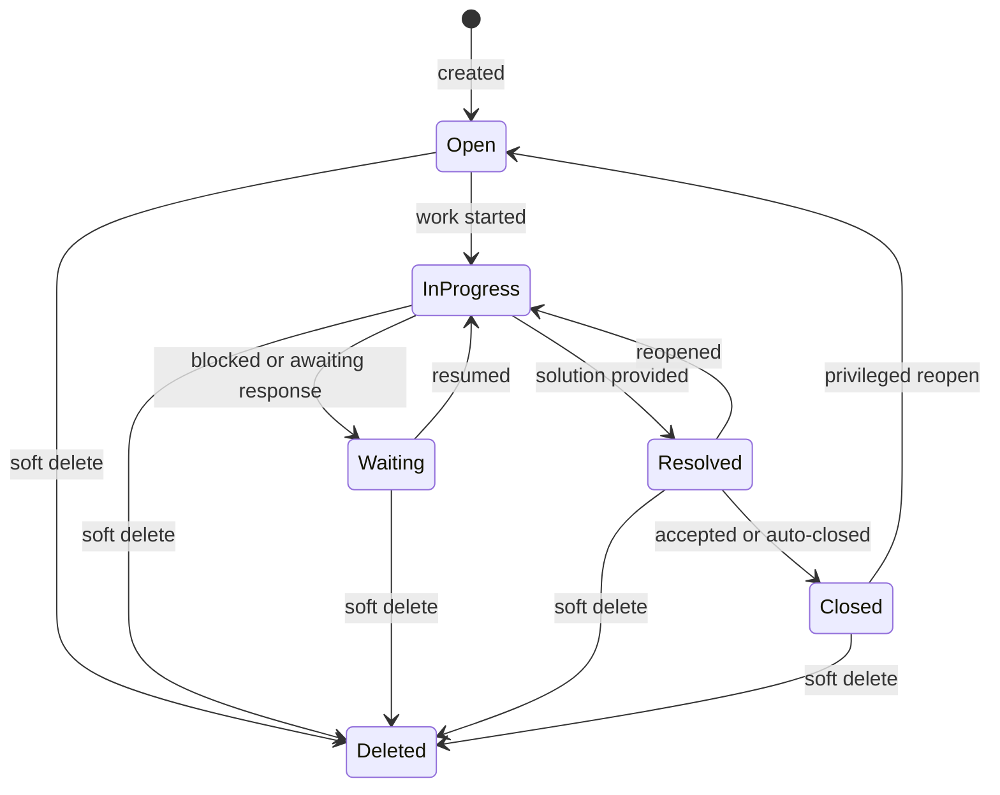

### Invitation Lifecycle

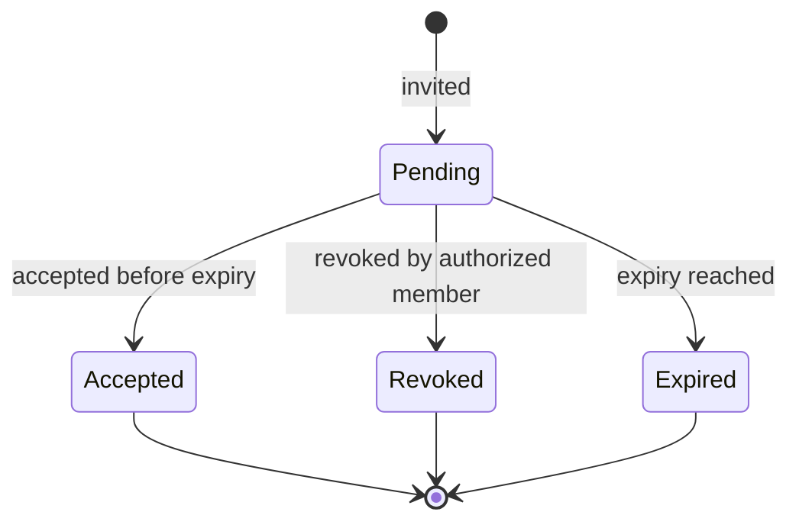

### Session Lifecycle

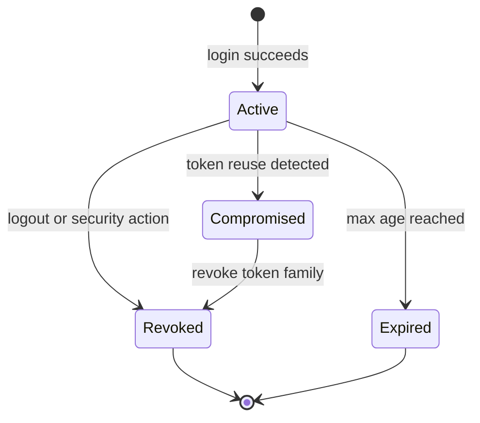

### Refresh Token Lifecycle

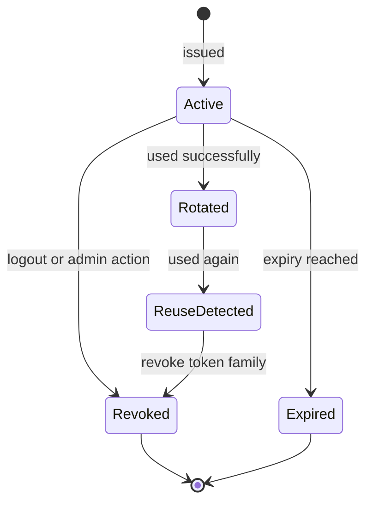

### Comment Lifecycle

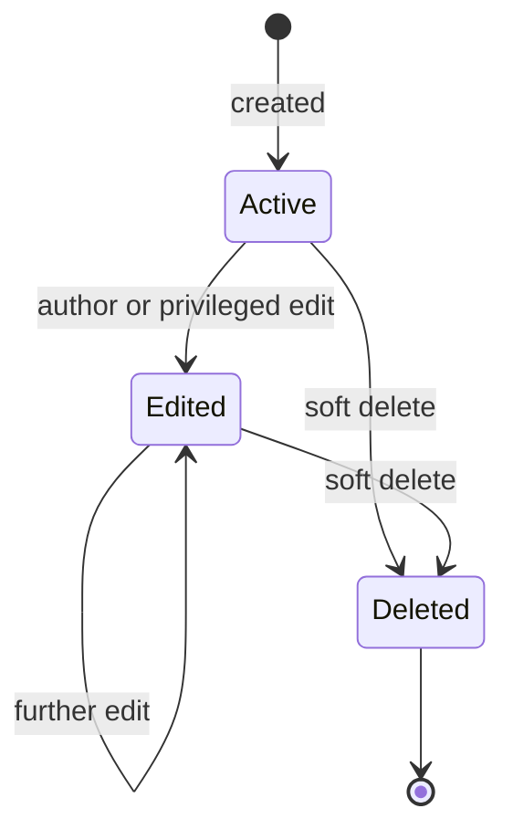

### Attachment Lifecycle

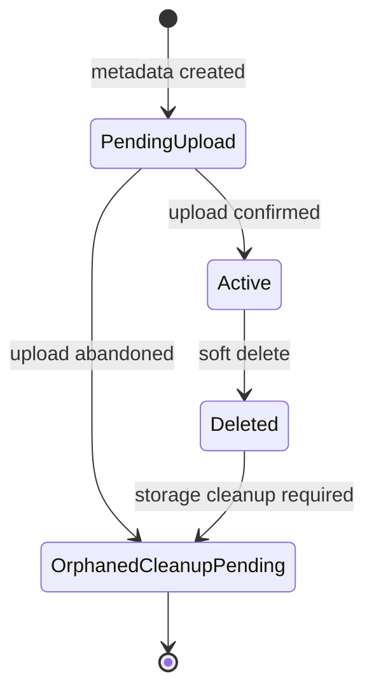

## Domain Events

Domain events describe important business facts. They do not imply event-driven architecture.

| Event | Why It Exists |
|---|---|
| OrganizationCreated | Records tenant creation and initial owner setup. |
| OrganizationDeactivated | Blocks future tenant operations and supports audit review. |
| UserRegistered | Records account creation. |
| PasswordChanged | Supports security audit and session invalidation decisions. |
| MemberInvited | Triggers invitation notification and audit trail. |
| InvitationAccepted | Converts pending access into active membership. |
| InvitationRevoked | Prevents invitation acceptance and records administrative action. |
| MemberRoleChanged | Records authorization-impacting change. |
| MemberRemoved | Records access removal and may trigger reassignment workflows. |
| TeamCreated | Records team setup inside a tenant. |
| TicketCreated | Starts ticket lifecycle and may notify relevant users. |
| TicketAssigned | Records ownership change and notifies assignee. |
| TicketStatusChanged | Records workflow transition. |
| TicketResolved | Marks work as resolved and may notify creator or watchers. |
| TicketClosed | Ends normal ticket workflow. |
| CommentAdded | Records collaboration and may notify participants. |
| AttachmentUploaded | Records file metadata association. |
| NotificationQueued | Records delivery intent. |
| NotificationFailed | Supports operational visibility and retry review. |
| RefreshTokenRotated | Records normal session continuation. |
| RefreshTokenReuseDetected | Records suspected credential compromise and triggers revocation. |

## Business Rules

- Users authenticate at the account level, not the organization level.
- Organization access is granted only through active membership.
- Role permissions are evaluated within an organization context.
- Platform-level permissions must be separate from organization-level permissions.
- The last organization owner cannot be removed, suspended, or demoted.
- Organization deactivation blocks normal tenant-scoped writes.
- Invitations must expire.
- Revoked invitations cannot be accepted.
- A user cannot accept an invitation for a different email unless the final invitation design explicitly supports verified email aliases.
- Team membership requires active organization membership.
- Tickets must be tenant-scoped.
- Tickets cannot be assigned to users or teams outside the organization.
- Ticket status transitions must follow the documented lifecycle.
- Closed tickets cannot be reassigned unless reopened or handled by privileged override.
- Comments require access to the parent ticket.
- Attachments require access to the parent ticket or comment.
- Notification delivery must not block the core business transaction.
- Audit logs should be written for security-sensitive and business-critical actions.
- Refresh token reuse must be treated as suspicious.

## Domain Constraints

Constraints that later database, API, and service designs must enforce:

- Unique normalized user email among active accounts.
- Unique organization slug.
- Unique active membership per user and organization.
- Optional unique team name per organization.
- Required organization ID on tenant-scoped resources.
- Required actor ID for user-initiated audit logs.
- Required correlation ID where request context exists.
- Bounded ticket title and description lengths.
- Enumerated ticket status values.
- Enumerated ticket priority values.
- Bounded comment body length.
- Attachment MIME type allowlist.
- Attachment maximum size.
- Refresh token expiration.
- Invitation expiration.
- Notification retry limit.

## Domain Boundaries

| Boundary | Owns | Does Not Own |
|---|---|---|
| Authentication | Identity proof, sessions, refresh tokens, password verification. | Tenant permissions. |
| Authorization | Roles, permissions, access decisions. | Password verification or token issuance. |
| Organization | Tenant lifecycle and tenant ownership. | User account identity. |
| Ticketing | Tickets, comments, attachment relationships, ticket workflow. | Notification transport. |
| Notification | Delivery intent, delivery status, retry outcomes. | Business state changes that trigger notifications. |
| Audit | Immutable record of important actions. | Authorization enforcement. |
| Infrastructure | Database, cache, queues, providers, deployment concerns. | Business rules. |

## Design Decisions

### Model the Domain Before the Architecture

Decision:

- Define business concepts and rules before technical structure.

Reasoning:

- Prevents APIs and collections from being shaped around accidental implementation details.
- Makes domain language consistent across documents.
- Helps future engineers implement the same system without interpretation drift.

### Organization as Tenant Boundary

Decision:

- Treat organization as the tenant and primary ownership boundary.

Reasoning:

- Most business resources are organization-scoped.
- RBAC depends on organization membership.
- Database indexes and authorization checks can consistently include organization context.

### Membership as a First-Class Entity

Decision:

- Model membership separately from user and organization.

Reasoning:

- Users can belong to multiple organizations.
- Roles and statuses are organization-specific.
- Membership is the correct place for tenant-scoped access state.

### Ticket as Collaboration Aggregate

Decision:

- Model ticket as the aggregate root for comments and ticket-level attachments.

Reasoning:

- Comments and attachments are meaningful only through ticket access.
- Ticket lifecycle controls collaboration rules.
- Ticket-scoped tests can verify comments, assignment, and tenant isolation together.

### Domain Events Without Event-Driven Architecture

Decision:

- Document important domain events without adopting event sourcing or a distributed event bus.

Reasoning:

- Events clarify audit, notification, and testing needs.
- BullMQ can process asynchronous side effects where needed.
- Full event-driven architecture is not justified for the project scope.

## Trade-offs

### Explicit Domain Model vs. Faster Architecture Writing

Adding a domain model creates more documentation work upfront.

This is acceptable because it reduces ambiguity in database design, API design, RBAC, tenant isolation, and tests.

### Rich Ownership Rules vs. Simple CRUD

Ownership and invariants make the system more complex than basic CRUD.

This is acceptable because multi-tenant SaaS systems require explicit ownership to prevent security and data integrity failures.

### Domain Events vs. Implementation Simplicity

Domain events add vocabulary that could be mistaken for event sourcing.

This is acceptable because the document explicitly uses events as business facts only, not as an implementation mandate.

## Alternatives Considered

### Skip Domain Model and Go Directly to System Architecture

Rejected.

Reason:

- Technical architecture without business ownership rules can produce inconsistent APIs and weak tenant isolation.

### Treat User as the Main Aggregate for All Work

Rejected.

Reason:

- The business is tenant-centered, not user-centered.
- Tickets, teams, memberships, and audit logs belong to organizations.

### Treat Comments as Independent Aggregates

Rejected.

Reason:

- Comments have no business meaning without a ticket.
- Access to comments must be derived from access to the parent ticket.

### Treat Notifications as Pure Infrastructure

Rejected.

Reason:

- Notification delivery status and preferences are business-visible concepts.
- Provider calls are infrastructure, but notification intent is domain behavior.

## Risks

### Overly Broad Aggregates

Risk:

- Organization could become too large if every tenant-scoped operation is forced through one aggregate.

Mitigation:

- Use organization as ownership boundary, but allow ticket, team, membership, and notification as operational aggregate roots.

### Inconsistent Terminology

Risk:

- Documents may drift between tenant, organization, workspace, member, and user.

Mitigation:

- Use `00-glossary.md` as the terminology source.
- Update the glossary before introducing new terms.

### Weak Lifecycle Enforcement

Risk:

- APIs may allow invalid transitions such as accepting revoked invitations or reusing rotated refresh tokens.

Mitigation:

- Convert lifecycle diagrams into acceptance criteria and tests.

### Tenant Isolation Gaps

Risk:

- Resources may be queried by ID without organization context.

Mitigation:

- Require organization context for every tenant-scoped aggregate and repository operation.

## Future Extensions

Potential domain extensions:

- Billing subscription aggregate.
- Customer portal aggregate.
- SLA policy value objects.
- Ticket watcher relationships.
- Custom role aggregate.
- Webhook subscription aggregate.
- Organization usage limit policy.
- Knowledge base article aggregate.

These should be introduced only after core tenant, membership, ticketing, auth, notification, and audit behavior is implemented and tested.
