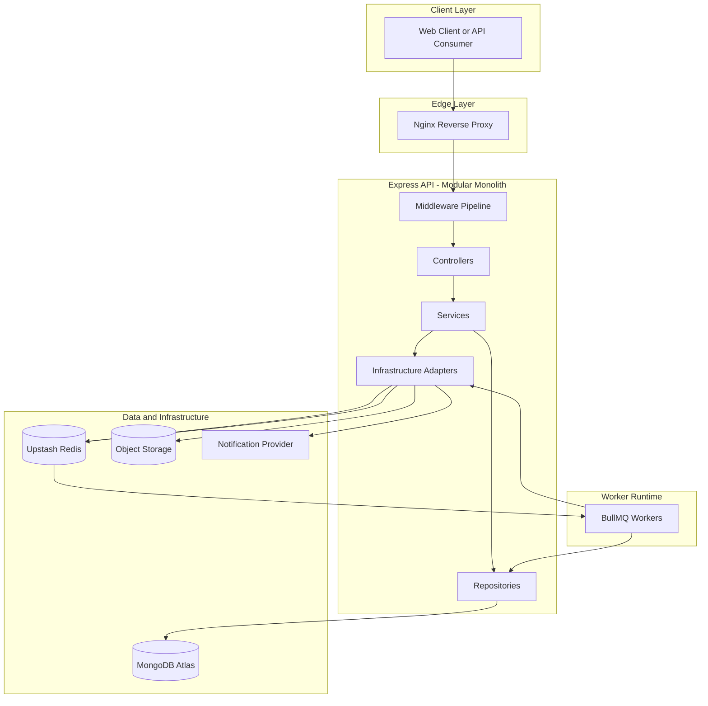
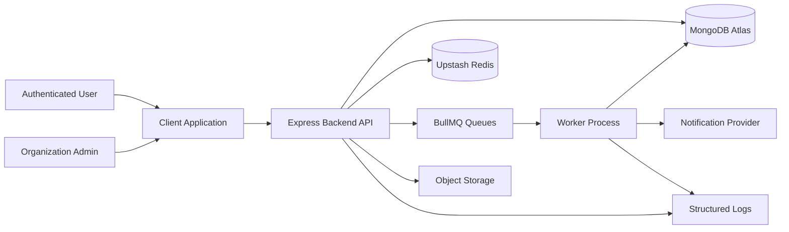
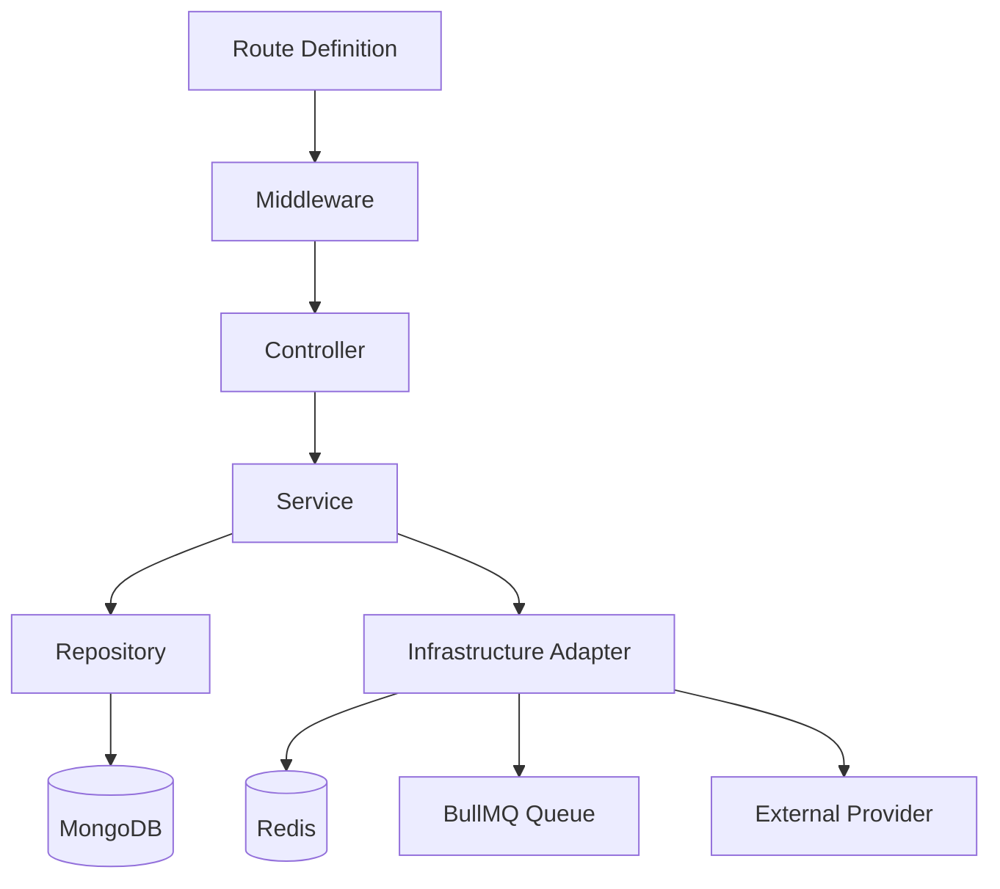
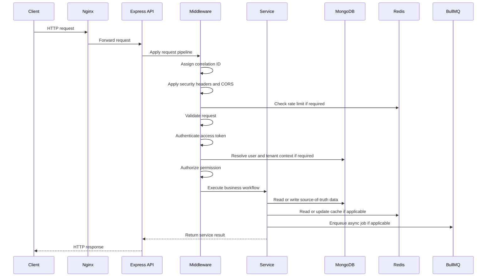
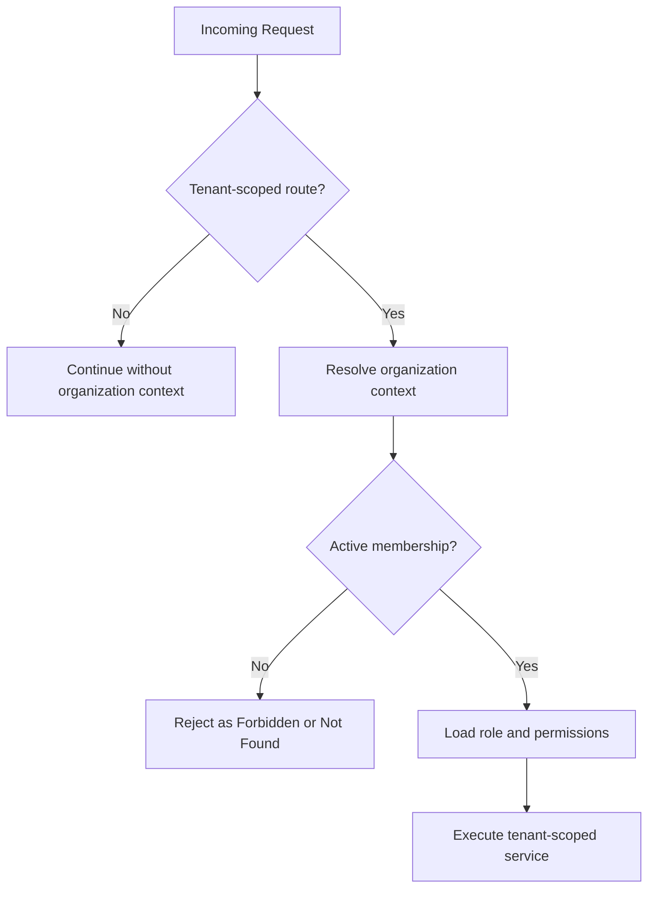
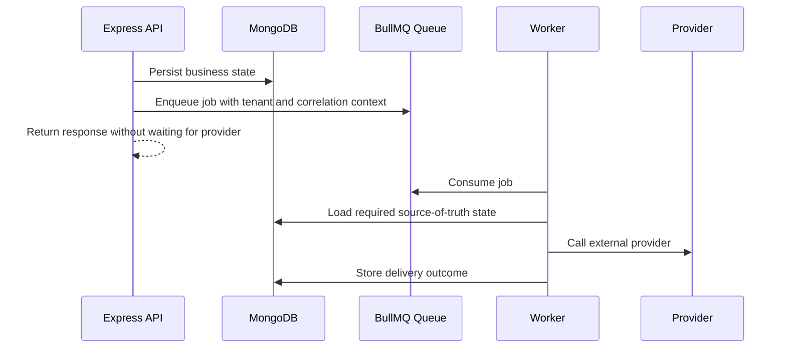
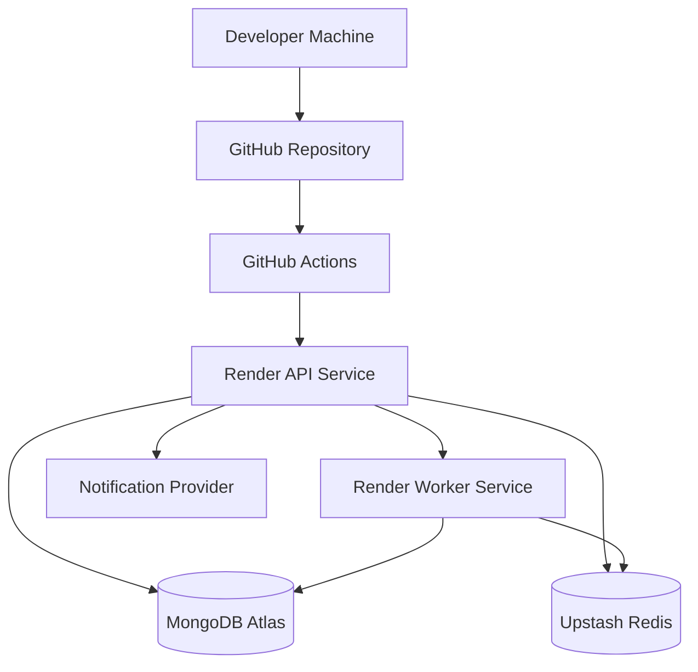
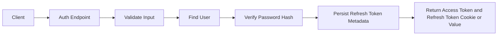
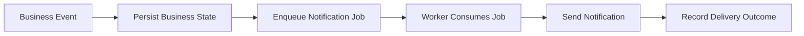

# 05. System Architecture

## Purpose

This document defines the high-level system architecture for the Multi-Tenant SaaS Backend.

It explains the runtime components, application boundaries, request lifecycle, dependency flow, data flow, failure behavior, and deployment shape. It is intended to guide future implementation without introducing source code.

## Scope

This document covers:

- System context.
- Runtime architecture.
- Modular monolith structure.
- Layered backend flow.
- API request lifecycle.
- Authentication and authorization placement.
- Tenant context resolution.
- MongoDB, Redis, and BullMQ responsibilities.
- Background worker architecture.
- Observability and health boundaries.
- Deployment topology.
- Architecture constraints and trade-offs.

Out of scope:

- Exact folder structure.
- Database collection schemas.
- Endpoint-by-endpoint API specification.
- RBAC permission matrix.
- Detailed cache key design.
- Detailed queue names and retry policies.
- Implementation code.

Those details are covered in later documents.

## Responsibilities

The system architecture must ensure:

- The API remains a single deployable modular monolith.
- Business modules are separated by domain responsibility.
- HTTP concerns do not leak into business logic.
- Database access is isolated behind repositories.
- External infrastructure access is isolated behind adapters.
- Authentication, authorization, validation, rate limiting, and error handling are middleware-driven.
- Tenant isolation is enforced before tenant-scoped business logic executes.
- Background work is handled outside request-critical paths.
- MongoDB remains the source of truth.
- Redis improves selected workflows but does not replace persistent business state.

## Architecture Style

The backend uses a modular monolith with layered architecture.

The architecture intentionally avoids microservices. Module boundaries are enforced inside the application through package organization, dependency direction, and service contracts.

## System Context

The API is the primary application boundary. Clients do not access MongoDB, Redis, queues, object storage, or notification providers directly.

## Runtime Components

| Component | Responsibility |
|---|---|
| Client | Sends HTTP requests to the backend. Security checks in the client are not trusted for enforcement. |
| Nginx | Optional reverse proxy for routing, compression, TLS termination, and request forwarding where applicable. |
| Express API | Main stateless HTTP application and business workflow coordinator. |
| Middleware Pipeline | Handles request ID, logging, security headers, CORS, rate limiting, validation, authentication, tenant context, RBAC, and errors. |
| Controllers | Convert validated HTTP input into service calls and shape HTTP responses. |
| Services | Execute business workflows and coordinate repositories, adapters, transactions, audit logs, and jobs. |
| Repositories | Encapsulate MongoDB access and tenant-aware queries. |
| Infrastructure Adapters | Encapsulate Redis, BullMQ, object storage, and notification providers. |
| MongoDB Atlas | Source of truth for users, organizations, memberships, teams, tickets, comments, attachments, notifications, audit logs, and token state. |
| Upstash Redis | Supports cache entries, rate limiting counters, and BullMQ queue storage. |
| BullMQ Workers | Process asynchronous work such as notifications, cleanup, and external provider calls. |
| Object Storage | Stores file binaries in future implementation. MongoDB stores attachment metadata only. |
| Notification Provider | Sends email or other notifications asynchronously through workers. |

## Layered Application Flow

Layer responsibilities:

- Routes bind paths and methods to middleware and controllers.
- Middleware handles cross-cutting request concerns.
- Controllers stay thin and HTTP-focused.
- Services own business decisions.
- Repositories own persistence details.
- Adapters own external infrastructure details.

Dependency direction must flow inward from HTTP and infrastructure concerns toward business services, not the reverse. Services may call repositories and adapters, but repositories should not call controllers or middleware.

## Module Boundaries

Initial system modules:

| Module | Responsibility |
|---|---|
| Auth | Registration, login, logout, refresh token rotation, password changes, session state. |
| Users | User profile and account-level user behavior. |
| Organizations | Tenant creation, organization settings, deactivation. |
| Memberships | Organization membership, invitation lifecycle, member status, role assignment. |
| RBAC | Permission definitions, role mapping, authorization checks. |
| Teams | Team creation, updates, member assignment, team-scoped ticket routing. |
| Tickets | Ticket lifecycle, assignment, filtering, searching, and soft deletion. |
| Comments | Ticket discussion and comment moderation. |
| Attachments | Attachment metadata and future object storage coordination. |
| Notifications | Notification records, preferences, queueing, and delivery status. |
| Audit Logs | Append-only security and business event history. |
| Health | Liveness, readiness, and dependency checks. |
| Shared Kernel | Common errors, response helpers, validation utilities, request context, constants, and pagination contracts. |

Modules should not bypass each other's public service APIs for business workflows. Shared utilities must remain generic and should not become a dumping ground for domain logic.

## Request Lifecycle

Required lifecycle behavior:

- Correlation ID is created early.
- Rate limiting occurs before expensive work.
- Validation occurs before business logic.
- Authentication occurs before protected resources.
- Tenant context is resolved before tenant-scoped operations.
- RBAC is enforced before privileged service actions.
- Errors are passed to centralized error handling.
- Audit logs are produced for critical state changes.
- External side effects are moved to background jobs where practical.

## Middleware Architecture

Middleware order should follow this conceptual sequence:

1. Request ID and request context initialization.
2. Security headers.
3. CORS.
4. Body parsing with size limits.
5. Request logging start.
6. Rate limiting.
7. Input validation.
8. Authentication.
9. Tenant context resolution.
10. RBAC authorization.
11. Controller execution.
12. Not-found handling.
13. Centralized error handling.
14. Request logging completion.

Exact implementation can vary, but authentication, tenant resolution, and authorization must not be skipped for protected tenant-scoped routes.

## Authentication Placement

Authentication belongs in middleware and supporting auth services.

Responsibilities:

- Verify access token structure and signature.
- Reject expired or invalid access tokens.
- Load minimal user identity needed for request context.
- Reject disabled or deleted users where required.
- Keep refresh token rotation inside explicit auth workflows.

Authentication must not decide organization permissions. It establishes identity only.

## Authorization Placement

Authorization belongs in RBAC middleware and service-level guard checks.

Responsibilities:

- Verify active organization membership.
- Resolve role and permissions.
- Enforce route-level permission requirements.
- Enforce resource-level ownership or assignment rules in services.
- Deny by default.

Route-level RBAC is not enough for all cases. Resource-specific rules, such as comment ownership or ticket assignment scope, must be enforced inside services where resource state is available.

## Tenant Context Resolution

Tenant context must be resolved before tenant-scoped services run.

Possible tenant context sources:

- Route parameter containing organization ID or slug.
- Explicit active organization selection.
- Resource lookup that derives organization from the parent resource.
- Job payload for background workers.

Tenant resolution rules:

- The backend must validate that the user has active membership in the organization.
- Tenant-scoped repositories must receive organization context.
- Tenant-scoped cache keys must include organization context.
- Tenant-scoped audit logs must include organization context.
- Client-provided organization IDs must never be trusted without membership verification.

## Data Architecture

MongoDB is the source of truth.

Data responsibilities:

- Persist user accounts and security state.
- Persist organizations and memberships.
- Persist tenant-scoped business records.
- Persist refresh token metadata needed for rotation and revocation.
- Persist audit logs.
- Persist notification records and delivery status where required.

Redis responsibilities:

- Store cache entries with explicit TTLs.
- Store rate limiting counters.
- Back BullMQ queues.
- Store short-lived operational values only when acceptable.

Redis must not be the only place where critical business state exists.

## Background Job Architecture

Background jobs handle work that is slow, retryable, scheduled, or dependent on external systems.

Worker requirements:

- Jobs must include correlation ID where available.
- Tenant-scoped jobs must include organization context.
- Workers must validate required job payload fields.
- Workers must be idempotent where practical.
- Transient failures must be retried with backoff.
- Retry exhaustion must be inspectable.
- Workers must support graceful shutdown.

## Caching Architecture

Caching is an optimization layer, not a correctness layer.

Appropriate cache candidates:

- Organization summary data.
- Permission metadata if invalidation rules are clear.
- Frequently requested read-only lookup values.
- Rate limiting counters.

Cache rules:

- Cache keys for tenant data must include organization ID.
- Cached data must have TTLs.
- Cache invalidation must be defined before caching mutable data.
- Cache misses must be treated as normal.
- MongoDB must remain authoritative.

## Error Handling Architecture

All errors should flow to centralized error handling.

Error categories:

- Validation error.
- Authentication error.
- Authorization error.
- Tenant access error.
- Not found error.
- Conflict error.
- Rate limit error.
- External dependency error.
- Internal server error.

Error responses must include:

- Stable error code.
- Human-readable message.
- Correlation ID.
- Field-level validation details when applicable.

Internal stack traces and secrets must not be exposed in production responses.

## Observability Architecture

The system must provide enough signals to debug requests and background jobs.

Required observability:

- Structured API request logs.
- Structured worker lifecycle logs.
- Correlation IDs across request-triggered jobs.
- Health check endpoints.
- Readiness checks for MongoDB and Redis where appropriate.
- Error logs with safe metadata.
- Job failure visibility.

Observability must avoid logging:

- Passwords.
- Access tokens.
- Refresh tokens.
- Secrets.
- Raw sensitive request payloads.

## Deployment Architecture

Initial deployment topology:

Deployment characteristics:

- API process and worker process should be separately runnable.
- API process should be stateless.
- Worker process should consume BullMQ jobs.
- MongoDB Atlas stores persistent data.
- Upstash Redis supports queues, cache, and rate limits.
- GitHub Actions validates changes before deployment.
- Docker Compose supports local development dependencies.

## Health Check Architecture

Health checks must separate process health from dependency readiness.

| Check | Purpose | Dependency Behavior |
|---|---|---|
| Liveness | Confirms the process is running. | Should not require database or Redis. |
| Readiness | Confirms the process can serve traffic. | May check MongoDB and Redis. |
| Worker Health | Confirms worker process is running. | May check Redis queue connection. |

Health responses must not expose secrets, credentials, internal URLs, or provider tokens.

## Data Flow by Use Case

### Login Flow

### Ticket Creation Flow

```mermaid
flowchart LR
    Client --> API[Ticket Endpoint]
    API --> Auth[Authenticate]
    Auth --> Tenant[Tenant Context]
    Tenant --> RBAC[Authorize ticket:create]
    RBAC --> Validate[Validate Ticket Data]
    Validate --> Persist[Persist Ticket]
    Persist --> Audit[Write Audit Log]
    Audit --> Queue[Queue Notifications]
    Queue --> Response[Return Ticket]
```

### Notification Flow

## Design Decisions

### Modular Monolith as Initial Architecture

The backend will be implemented as a modular monolith.

Reasoning:

- The project scope does not justify distributed services.
- A single API is easier to deploy, test, and reason about.
- Clean module boundaries still demonstrate senior architecture discipline.
- Future service extraction remains possible if real bottlenecks appear.

### MongoDB as Source of Truth

MongoDB stores authoritative business and security state.

Reasoning:

- It fits the selected MERN-oriented stack.
- It supports document modeling for SaaS resources.
- It provides indexing, aggregation, validation, and transactions where needed.
- It is available through MongoDB Atlas for practical deployment.

### Redis as Infrastructure Support

Redis supports caching, rate limiting, and BullMQ.

Reasoning:

- Redis is valuable for fast ephemeral data and queue infrastructure.
- Redis should not own critical business truth.
- Clear boundaries reduce correctness risk during outages.

### Separate API and Worker Runtimes

The API and worker should be separately runnable processes.

Reasoning:

- API latency should not depend on slow external work.
- Worker concurrency can scale separately.
- Operational failures in external providers should not directly block normal API responses.

### Middleware-Driven Cross-Cutting Concerns

Cross-cutting request behavior should live in middleware.

Reasoning:

- Authentication, validation, rate limiting, logging, and errors apply consistently across modules.
- Controllers remain thin.
- Service logic focuses on business workflows.

## Trade-offs

### Single Deployable vs. Independent Services

A modular monolith reduces operational complexity but does not allow independent service deployment.

This is acceptable because the system targets practical backend engineering for startup-scale and portfolio-scale use. Independent services can be extracted later only when actual team or scaling pressure justifies it.

### Shared Database Tenancy vs. Database Per Tenant

A shared database is cheaper and simpler but requires strict tenant filtering and tests.

This is acceptable because tenant isolation will be enforced through request context, repositories, indexes, RBAC, and integration tests.

### Async Jobs vs. Simpler Synchronous Calls

Background jobs add worker infrastructure and retry design.

This is acceptable for notifications and external provider work because it improves API latency, reliability, and failure handling.

### Caching vs. Operational Simplicity

Caching can improve read performance but increases invalidation complexity.

This is acceptable only for carefully selected data with explicit TTL and invalidation rules.

## Alternatives Considered

### Microservices

Rejected.

Reason:

- Not justified by the project scale.
- Adds distributed transactions, network failure modes, service deployment complexity, and observability burden.
- Weakens portfolio credibility if used without operational need.

### Server-Side Rendered Full Stack App as Primary Architecture

Rejected.

Reason:

- The project is backend-focused.
- API-first design better demonstrates backend architecture, security, and testability.
- A frontend can be added later without changing backend ownership.

### Database Per Tenant

Rejected for initial design.

Reason:

- Provisioning, migrations, backups, and connection management become more complex.
- Free-tier deployment becomes harder.
- Shared database tenancy is adequate with strong tenant isolation discipline.

### Synchronous Notification Delivery

Rejected.

Reason:

- External provider latency would affect API response time.
- Retry handling belongs in a queue-backed worker.
- API requests should persist business state and return without waiting on notification delivery.

### Redis as Primary Session Store

Rejected.

Reason:

- Refresh token revocation and reuse detection are security-critical.
- Persistent session metadata should live in MongoDB.
- Redis can support rate limiting and caching but should not be the only source for session truth.

## Best Practices

Architecture implementation should follow these practices:

- Keep controllers thin.
- Put business workflows in services.
- Put MongoDB access in repositories.
- Put external provider logic behind adapters.
- Enforce tenant context before tenant-scoped service execution.
- Add organization ID to tenant-scoped database access.
- Deny permissions by default.
- Use centralized error handling.
- Use structured logs with correlation IDs.
- Keep API and worker processes separately runnable.
- Use MongoDB as the source of truth.
- Treat Redis cache misses as normal.
- Queue external provider work through BullMQ.
- Validate configuration at startup.
- Avoid adding distributed-system patterns without a concrete reason.

## Risks

### Tenant Filter Bypass

Risk:

Repository methods may accidentally query without organization context.

Mitigation:

- Require tenant context in tenant-scoped repository methods.
- Add tenant isolation integration tests.
- Use compound indexes including organization ID.
- Review code paths that derive resources by ID.

### Business Logic Leakage Into Controllers

Risk:

Controllers may grow into workflow owners.

Mitigation:

- Keep controllers responsible for HTTP concerns only.
- Move workflow decisions into services.
- Test services independently where practical.

### Redis Overuse

Risk:

Redis may become an implicit source of truth.

Mitigation:

- Document cache use cases.
- Keep critical state in MongoDB.
- Treat Redis failures as degraded behavior except for queue-specific workflows.

### Worker Side Effect Duplication

Risk:

Retries may duplicate notifications or cleanup actions.

Mitigation:

- Use idempotency checks.
- Store delivery attempts.
- Include stable job context.
- Make job handlers safe to retry.

### Weak Observability

Risk:

Failures across API and workers may be hard to trace.

Mitigation:

- Propagate correlation IDs.
- Log request and job lifecycles.
- Include safe tenant and actor metadata where available.

## Future Improvements

Potential architecture improvements after the core system is complete:

- Add OpenTelemetry tracing.
- Add centralized log aggregation.
- Add metrics dashboards.
- Add object storage with signed upload and download URLs.
- Add WebSocket or Server-Sent Events for real-time ticket updates.
- Add MongoDB Atlas Search for advanced search.
- Extract notification delivery into a separate service only if operational needs justify it.
- Add multi-region deployment only if product requirements justify the complexity.

These improvements should not be included before the modular monolith is implemented, tested, and deployed successfully.
