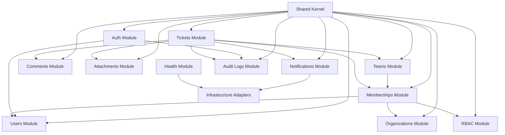
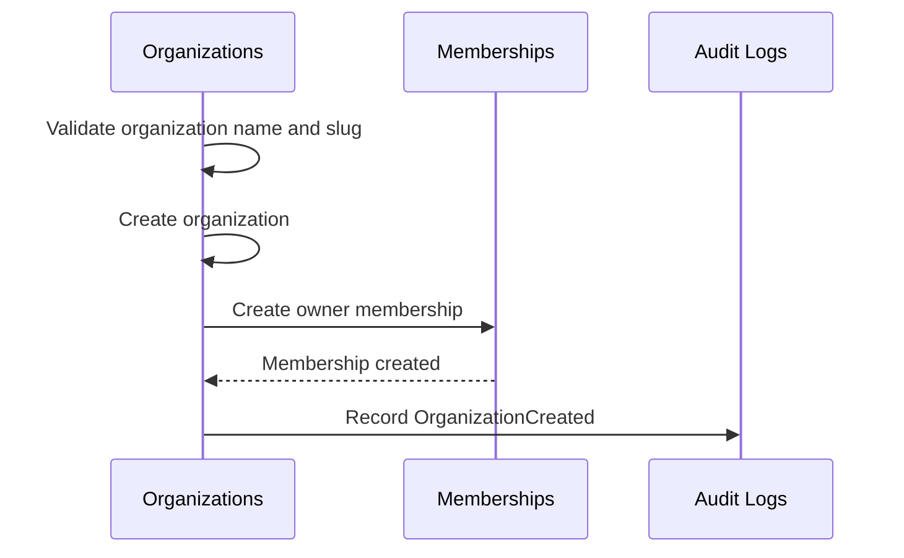
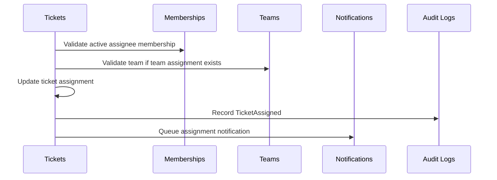

# 06. Module Architecture

## Purpose

This document defines the module architecture for the Multi-Tenant SaaS Backend.

It translates the domain model into backend module boundaries. The goal is to make responsibilities, dependencies, ownership, and cross-module collaboration explicit before implementation begins.

## Scope

This document covers:

- Module map.
- Module responsibilities.
- Public module contracts.
- Dependency rules.
- Cross-cutting modules.
- Cross-module workflows.
- Module-level testing expectations.
- Trade-offs, risks, and future improvements.

Out of scope:

- Concrete folder structure.
- Express route definitions.
- Controller implementation.
- MongoDB schemas.
- API endpoint contracts.

## Responsibilities

The module architecture must ensure:

- Business modules follow domain boundaries.
- Modules communicate through service contracts, not direct data access shortcuts.
- Tenant-scoped modules enforce organization context.
- Cross-cutting concerns remain centralized.
- Infrastructure details stay behind adapters.
- Modules can be tested independently where practical.

## Module Map

## Module Dependency Rules

Allowed:

- Controllers call services in the same module.
- Services call repositories in the same module.
- Services call public services from another module only for business coordination.
- Modules use shared kernel utilities for generic concerns.
- Modules use infrastructure adapters through explicit interfaces.

Not allowed:

- Controllers directly calling repositories.
- Repositories calling services.
- Modules reading another module's persistence collections directly for business workflows.
- Infrastructure adapters owning business rules.
- Shared kernel containing domain-specific decisions.

## Core Modules

### Auth Module

Purpose:

- Own authentication workflows and session security.

Responsibilities:

- Registration.
- Login.
- Logout.
- Global logout.
- Password change.
- Refresh token rotation.
- Token reuse detection.
- Session revocation.

Owns:

- Session lifecycle.
- Refresh token lifecycle.
- Password credential verification.

Depends on:

- Users module for account identity.
- Audit logs module for security events.
- Infrastructure adapters for token signing and secure time handling where needed.

Must not own:

- Organization permissions.
- Tenant-scoped authorization.
- Ticket or organization business rules.

### Users Module

Purpose:

- Own account-level user identity and profile behavior.

Responsibilities:

- User profile retrieval.
- Safe profile updates.
- Account status checks.
- Email normalization rules.

Owns:

- User account identity.
- Account lifecycle state.

Depends on:

- Shared validation and error contracts.

Must not own:

- Organization role assignment.
- Membership status.
- Tenant-scoped access rules.

### Organizations Module

Purpose:

- Own tenant lifecycle and organization settings.

Responsibilities:

- Organization creation.
- Organization profile updates.
- Organization deactivation.
- Tenant-level settings.

Owns:

- Organization identity.
- Organization slug.
- Organization lifecycle state.

Depends on:

- Memberships module for initial owner creation.
- Audit logs module for organization lifecycle events.

Must not own:

- User identity.
- Ticket workflows.

### Memberships Module

Purpose:

- Own the relationship between users and organizations.

Responsibilities:

- Invitation creation.
- Invitation acceptance.
- Invitation revocation.
- Member listing.
- Role assignment.
- Member removal.
- Membership status changes.

Owns:

- Membership lifecycle.
- Invitation lifecycle.
- Organization role assignment.

Depends on:

- Users module for user identity.
- Organizations module for tenant existence.
- RBAC module for role hierarchy validation.
- Audit logs module for access changes.
- Notifications module for invitation delivery.

Must not own:

- Password authentication.
- Ticket lifecycle.

### RBAC Module

Purpose:

- Own role and permission evaluation.

Responsibilities:

- Permission matrix definition.
- Role hierarchy rules.
- Permission resolution.
- Deny-by-default behavior.
- Platform vs organization permission distinction.

Owns:

- Role-to-permission mapping.
- Authorization decision logic.

Depends on:

- Memberships module for active membership context.

Must not own:

- Authentication.
- Business workflow execution.

### Teams Module

Purpose:

- Own team grouping inside organizations.

Responsibilities:

- Team creation.
- Team updates.
- Team archive or deletion policy.
- Team member assignment.
- Team member removal.

Owns:

- Team lifecycle.
- Team membership within an organization.

Depends on:

- Memberships module to validate active organization members.
- Audit logs module for administrative changes.

Must not own:

- User account identity.
- Cross-tenant grouping.

### Tickets Module

Purpose:

- Own ticket workflow and operational work state.

Responsibilities:

- Ticket creation.
- Ticket retrieval.
- Ticket listing.
- Ticket filtering and search coordination.
- Ticket assignment.
- Status transitions.
- Priority updates.
- Soft deletion.

Owns:

- Ticket lifecycle.
- Assignment rules.
- Ticket status rules.

Depends on:

- Memberships module for assignee validation.
- Teams module for team assignment validation.
- Comments module for collaboration.
- Attachments module for linked metadata.
- Notifications module for async delivery intent.
- Audit logs module for critical ticket events.

Must not own:

- Notification transport.
- Raw file storage.

### Comments Module

Purpose:

- Own ticket discussion behavior.

Responsibilities:

- Comment creation.
- Comment update.
- Comment soft deletion.
- Comment listing.

Owns:

- Comment lifecycle.
- Author edit rules.

Depends on:

- Tickets module for parent ticket access.
- Audit logs module for privileged changes.
- Notifications module for comment notifications.

Must not own:

- Ticket status.
- Ticket assignment.

### Attachments Module

Purpose:

- Own attachment metadata and parent-resource association.

Responsibilities:

- Attachment metadata creation.
- Attachment metadata retrieval.
- Attachment soft deletion.
- Storage cleanup intent.

Owns:

- Attachment lifecycle.
- File metadata validation.

Depends on:

- Tickets or Comments module for parent access.
- Infrastructure adapters for future object storage.
- Audit logs module for deletion events.

Must not own:

- File binary storage.
- Ticket workflow.

### Notifications Module

Purpose:

- Own notification intent and delivery state.

Responsibilities:

- Notification creation.
- Notification preference evaluation.
- Queueing notification jobs.
- Recording delivery status.
- Retry outcome tracking.

Owns:

- Notification lifecycle.
- Delivery intent.

Depends on:

- Infrastructure adapters for BullMQ and notification providers.

Must not own:

- Business events that trigger notifications.
- Authorization decisions.

### Audit Logs Module

Purpose:

- Own immutable business and security event history.

Responsibilities:

- Audit log creation.
- Audit log query for authorized users.
- Safe metadata handling.

Owns:

- Audit event records.
- Audit metadata shape.

Depends on:

- Shared request context for actor, organization, and correlation ID.

Must not own:

- Business rule enforcement.
- Authorization decisions beyond access to audit views.

### Health Module

Purpose:

- Own operational health visibility.

Responsibilities:

- Liveness checks.
- Readiness checks.
- Dependency status checks.
- Worker health signaling where applicable.

Owns:

- Health response contracts.

Depends on:

- Infrastructure adapters for dependency checks.

Must not own:

- Business health metrics.
- Sensitive operational details.

### Shared Kernel

Purpose:

- Provide generic primitives used across modules.

Allowed contents:

- Error classes.
- Response envelope contracts.
- Pagination contracts.
- Request context contracts.
- Validation helpers.
- Date/time helpers.
- Constants with no domain ownership.

Not allowed:

- Ticket business logic.
- RBAC policy logic.
- Organization lifecycle rules.
- Persistence access.

## Cross-Module Workflows

### Organization Creation

### Ticket Assignment

## Design Decisions

### Domain-Aligned Modules

Decision:

- Modules follow the domain model rather than technical concerns alone.

Reasoning:

- Business ownership remains clear.
- Database and API design can map back to the same boundaries.
- Interview explanations become defensible.

### Shared Kernel Kept Small

Decision:

- Shared code must stay generic.

Reasoning:

- Large shared modules create hidden coupling.
- Domain rules belong in domain modules.

### Public Service Contracts Between Modules

Decision:

- Modules coordinate through public services instead of direct repository access.

Reasoning:

- Keeps ownership boundaries enforceable.
- Prevents accidental bypass of tenant and authorization rules.

## Trade-offs

- More modules increase initial structure, but reduce long-term ambiguity.
- Strict boundaries may require extra service calls, but improve correctness and testability.
- Keeping the system as a modular monolith avoids distributed complexity while preserving future extraction options.

## Alternatives Considered

### Single Feature Folder

Rejected because it hides business ownership and encourages mixed concerns.

### Technical-Layer-Only Modules

Rejected because folders like `controllers`, `services`, and `models` alone do not express domain boundaries.

### Microservices

Rejected because the operational complexity is not justified for this project scope.

## Best Practices

- Keep module APIs explicit.
- Keep controllers thin.
- Keep business rules in services.
- Keep repositories tenant-aware.
- Keep infrastructure behind adapters.
- Test module workflows at service and API levels.
- Add cross-tenant tests for every tenant-scoped module.

## Risks

- Modules may become too coupled if services expose broad methods.
- Shared kernel may become a dumping ground.
- RBAC checks may be duplicated if not centralized.
- Ticket module may grow too large if comments and attachments are not clearly bounded.

## Future Improvements

- Add module ownership tables once implementation begins.
- Add dependency linting if the codebase grows.
- Extract notification delivery only if operational pressure justifies it.
- Add custom roles as a separate module if fixed RBAC becomes insufficient.
