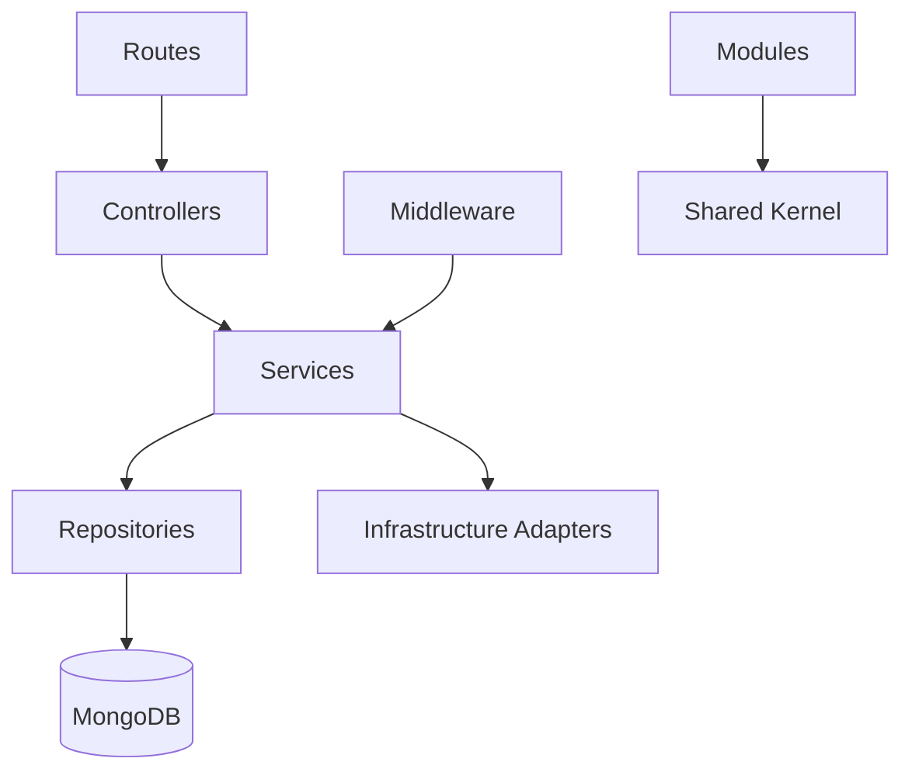

# 07. Folder Structure

## Purpose

This document defines the future backend source-code organization for the Multi-Tenant SaaS Backend.

The repository currently remains documentation-only. This structure is a design contract for the implementation phase, not an instruction to create source files now.

## Scope

This document covers:

- Planned backend folder structure.
- Folder responsibilities.
- Module layout.
- Naming conventions.
- Import and dependency rules.
- Test placement.
- Configuration and deployment file placement.

Out of scope:

- Actual source file creation.
- Express route implementation.
- MongoDB model implementation.
- Controller or service code.

## Responsibilities

The folder structure must:

- Reflect the modular monolith architecture.
- Keep business modules cohesive.
- Separate HTTP, service, repository, validation, and infrastructure concerns.
- Make tenant-aware code easy to locate and review.
- Support Jest and Supertest tests.
- Support API and worker runtimes.
- Avoid framework-specific clutter leaking across modules.

## Proposed Repository Structure

```text
multi-tenant-saas-backend/
├── README.md
├── docs/
├── app/
│   ├── src/
│   │   ├── app.ts
│   │   ├── server.ts
│   │   ├── worker.ts
│   │   ├── config/
│   │   ├── shared/
│   │   ├── infrastructure/
│   │   ├── middleware/
│   │   ├── modules/
│   │   └── tests/
│   ├── package.json
│   ├── tsconfig.json
│   ├── jest.config.js
│   └── Dockerfile
├── docker-compose.yml
├── nginx/
└── .github/
    └── workflows/
```

The `app/` directory should be introduced only when implementation starts.

## Source Structure

```text
app/src/
├── app.ts
├── server.ts
├── worker.ts
├── config/
│   ├── env.ts
│   ├── database.ts
│   ├── redis.ts
│   └── security.ts
├── shared/
│   ├── errors/
│   ├── responses/
│   ├── validation/
│   ├── pagination/
│   ├── request-context/
│   ├── constants/
│   └── utils/
├── infrastructure/
│   ├── database/
│   ├── redis/
│   ├── queue/
│   ├── object-storage/
│   ├── notifications/
│   └── logging/
├── middleware/
│   ├── request-id/
│   ├── logging/
│   ├── error-handler/
│   ├── validation/
│   ├── authentication/
│   ├── tenant-context/
│   ├── authorization/
│   └── rate-limit/
├── modules/
│   ├── auth/
│   ├── users/
│   ├── organizations/
│   ├── memberships/
│   ├── rbac/
│   ├── teams/
│   ├── tickets/
│   ├── comments/
│   ├── attachments/
│   ├── notifications/
│   ├── audit-logs/
│   └── health/
└── tests/
    ├── setup/
    ├── fixtures/
    ├── helpers/
    ├── unit/
    ├── integration/
    └── api/
```

## Standard Module Layout

Each business module should follow one consistent internal shape.

```text
modules/<module-name>/
├── <module-name>.routes.ts
├── <module-name>.controller.ts
├── <module-name>.service.ts
├── <module-name>.repository.ts
├── <module-name>.validation.ts
├── <module-name>.types.ts
├── <module-name>.constants.ts
└── index.ts
```

Optional files:

```text
modules/<module-name>/
├── <module-name>.policy.ts
├── <module-name>.events.ts
├── <module-name>.mapper.ts
├── <module-name>.jobs.ts
└── __tests__/
```

Rules:

- Routes define HTTP mapping only.
- Controllers handle HTTP request and response concerns.
- Services own workflows and business rules.
- Repositories own database access.
- Validation files define request validation contracts.
- Policy files own module-specific authorization or state-transition rules.
- Event files define domain event names and payload contracts, not event-driven infrastructure.

## Module Folder Responsibilities

| Module | Folder | Responsibility |
|---|---|---|
| Auth | `modules/auth` | Login, logout, refresh token rotation, password workflows. |
| Users | `modules/users` | Account profile and user lifecycle. |
| Organizations | `modules/organizations` | Tenant lifecycle and settings. |
| Memberships | `modules/memberships` | Invitations, members, roles, membership status. |
| RBAC | `modules/rbac` | Permission matrix and authorization policy. |
| Teams | `modules/teams` | Team lifecycle and team membership. |
| Tickets | `modules/tickets` | Ticket workflow, listing, filtering, assignment. |
| Comments | `modules/comments` | Ticket discussion. |
| Attachments | `modules/attachments` | Attachment metadata. |
| Notifications | `modules/notifications` | Notification intent, queueing, delivery status. |
| Audit Logs | `modules/audit-logs` | Audit event creation and querying. |
| Health | `modules/health` | Liveness and readiness checks. |

## Shared Folder Rules

Allowed in `shared/`:

- Generic error types.
- Generic API response contracts.
- Request context types.
- Pagination helpers.
- Validation primitives.
- Date/time helpers.
- Safe object utilities.

Not allowed in `shared/`:

- Ticket status transition logic.
- Role permission matrix.
- Organization lifecycle rules.
- MongoDB queries.
- Notification provider logic.

## Infrastructure Folder Rules

Infrastructure adapters should hide third-party details.

```text
infrastructure/
├── database/
│   ├── connection.ts
│   └── transaction.ts
├── redis/
│   └── redis-client.ts
├── queue/
│   ├── queue-client.ts
│   └── worker-registry.ts
├── object-storage/
│   └── storage-client.ts
├── notifications/
│   └── notification-provider.ts
└── logging/
    └── logger.ts
```

Rules:

- Modules should not instantiate Redis, BullMQ, MongoDB, or provider clients directly.
- Infrastructure should not contain business rules.
- External provider errors should be translated into application-level errors.

## Middleware Folder Rules

Middleware is for cross-cutting HTTP behavior.

Required middleware groups:

- Request ID.
- Structured request logging.
- Error handling.
- Validation.
- Authentication.
- Tenant context.
- Authorization.
- Rate limiting.
- Security headers.
- CORS.

Middleware must not contain module-specific workflows.

## Test Structure

```text
tests/
├── setup/
│   ├── test-app.ts
│   ├── test-db.ts
│   └── test-env.ts
├── fixtures/
│   ├── users.fixture.ts
│   ├── organizations.fixture.ts
│   └── tickets.fixture.ts
├── helpers/
│   ├── auth-helper.ts
│   └── tenant-helper.ts
├── unit/
├── integration/
└── api/
```

Testing rules:

- Unit tests target pure business logic and policies.
- Integration tests target repositories and service workflows.
- API tests target HTTP behavior with Supertest.
- Tenant isolation tests must exist for tenant-scoped modules.
- Auth and RBAC tests must cover allowed and forbidden paths.

## Naming Conventions

- Folder names use kebab-case.
- Module names use plural nouns where they represent resource collections.
- Files use kebab-case with responsibility suffixes.
- Type and class names use PascalCase.
- Functions and variables use camelCase.
- Constants use UPPER_SNAKE_CASE only for true constants.
- Environment variables use UPPER_SNAKE_CASE.

## Dependency Direction



Rules:

- Routes cannot import repositories.
- Controllers cannot import repositories.
- Repositories cannot import controllers, routes, or services.
- Infrastructure cannot import business modules.
- Shared cannot import modules.

## Design Decisions

### Module-First Source Layout

Decision:

- Organize by business module first, then layer inside each module.

Reasoning:

- Keeps related routes, services, repositories, validation, and tests close together.
- Scales better than large global `controllers/`, `services/`, and `models/` folders.

### Separate API and Worker Entrypoints

Decision:

- Use separate `server.ts` and `worker.ts` entrypoints.

Reasoning:

- API and worker runtimes have different lifecycle and scaling concerns.
- Background jobs should not be tied to HTTP server startup.

### Centralized Infrastructure Adapters

Decision:

- Keep MongoDB, Redis, BullMQ, storage, notification, and logging adapters outside modules.

Reasoning:

- Prevents provider lock-in from spreading through business modules.
- Keeps tests easier to isolate.

## Trade-offs

- Module-first layout creates more files initially, but improves ownership.
- Shared adapters add indirection, but prevent external provider details leaking into services.
- Separate API and worker entrypoints add deployment complexity, but improve operational control.

## Alternatives Considered

### Global Layer Folders

Rejected because global `controllers/`, `services/`, and `repositories/` folders become hard to navigate as modules grow.

### Single Flat Source Folder

Rejected because it does not express architecture or ownership.

### Separate Packages Per Module

Rejected for initial implementation because it adds package management complexity without clear benefit.

## Best Practices

- Keep modules cohesive.
- Keep shared utilities generic.
- Keep service methods business-oriented.
- Keep repository methods tenant-aware.
- Keep validation close to route input.
- Keep tests near behavior or grouped by test type consistently.
- Keep implementation aligned with documentation names.

## Risks

- Developers may bypass module services for convenience.
- Shared folder may accumulate domain logic.
- File count may grow quickly.
- Tests may become scattered if placement rules are not followed.

## Future Improvements

- Add dependency boundary linting.
- Add generated API documentation from validation and route metadata.
- Split worker code into job-specific folders once jobs become numerous.
- Introduce package-level module boundaries only if the codebase outgrows simple folders.
