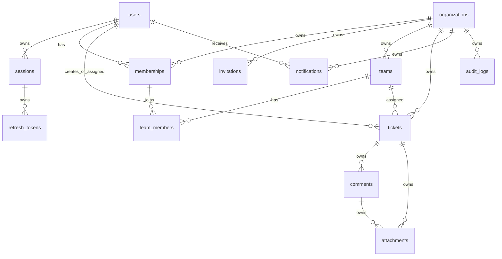

# 08. Database Design

## Purpose

This document defines the MongoDB database design for the Multi-Tenant SaaS Backend.

It translates the business domain model into a persistence strategy that is secure, tenant-aware, query-efficient, and interview-defensible. The design emphasizes production-grade trade-offs over theoretical perfection.

## Scope

This document covers:

- Tenant isolation strategy and ownership rules.
- Collections, relationships, and responsibilities.
- Index design, unique constraints, and TTL usage.
- Soft-delete and audit conventions.
- Transaction boundaries and write consistency expectations.
- Validation rules and aggregation opportunities.

Out of scope:

- ORM or driver implementation details.
- Full JSON schema definitions.
- Migration scripts.
- API response contracts.

## Responsibilities

The database design must:

- Preserve tenant isolation for every organization-scoped record.
- Support authentication, RBAC, organization, ticketing, and audit workflows.
- Make reads efficient for common list and detail screens.
- Prevent accidental cross-tenant access or data leakage.
- Preserve auditability for security and business-critical events.
- Make refresh token rotation and session invalidation reliable.
- Keep MongoDB as the source of truth while using Redis for caching and queueing.

## Design Decisions

### 1. Shared Database Multi-Tenancy

The system uses a shared database model with explicit tenant scoping through `organizationId` on every tenant-owned collection.

Why this is appropriate:

- It is simple to reason about for a portfolio project.
- It keeps the architecture practical and maintainable.
- It is a strong interview topic because it demonstrates real multi-tenant awareness.

### 2. Document-Oriented Modeling for SaaS Entities

Core business entities such as users, organizations, tickets, comments, and memberships are modeled as documents.

This fits the product because:

- ticket threads and comments naturally behave as nested or related documents,
- tenant-scoped lists are easy to query,
- the schema can evolve without heavy migrations in the early phase.

### 3. Soft Deletes for Business Records

Records such as tickets, comments, teams, attachments, and memberships use soft deletion rather than hard deletion.

This preserves history and reduces the risk of accidental data loss.

### 4. Append-Only Audit Logs

Audit events are treated as append-only records.

This supports:

- security investigations,
- admin traceability,
- compliance-friendly history,
- post-hoc review of critical workflow changes.

### 5. Separate Token Collections

Authentication state is deliberately separated from core user identity.

This improves security and makes session revocation simpler.

## Trade-offs

- Shared database multi-tenancy is simpler than schema-per-tenant or database-per-tenant, but it requires careful query discipline.
- Embedded documents reduce joins but can make large updates and history management more complex.
- Soft deletes add query complexity but improve safety and auditability.
- Append-only logs increase storage growth, but they provide better trust and traceability.

## Alternatives Considered

- Database-per-tenant: stronger isolation, but too operationally heavy for the target scope.
- Schema-per-tenant: more isolation, but harder to operate and maintain.
- Hard deletes for business records: simpler, but unacceptable for audit and support workflows.
- Pure relational modeling: more familiar for some teams, but less aligned with the chosen stack and product shape.

## Best Practices

- Always filter tenant-scoped queries by `organizationId`.
- Use compound indexes for the most common workflows.
- Keep index cardinality in mind.
- Avoid storing secrets in documents.
- Prefer explicit status fields over ambiguous booleans.
- Use timestamps consistently for create/update/delete lifecycle events.

## Risks

- Missing `organizationId` filters can cause cross-tenant data leaks.
- Too many indexes can slow writes.
- Unbounded audit log growth can become costly if retention is not planned.
- Soft-delete logic can create stale references if not carefully managed.

## Future Improvements

- Add Atlas Search for full-text ticket search.
- Introduce retention policies for audit and notification data.
- Add sharding or partitioning if the platform grows beyond the initial portfolio scope.
- Move to a more explicit event-driven pattern only if the product justifies it.

## Database Principles

- Every tenant-scoped collection must include `organizationId`.
- Every query for tenant-scoped data must filter by `organizationId`.
- Business-critical uniqueness should be enforced at the database level where practical.
- Soft deletes are preferred for business records.
- Passwords, refresh tokens, reset tokens, and session secrets must never be stored in plaintext.
- Indexes must support real query patterns, not theoretical ones.
- Redis is a cache and job store, not a source of truth.

## Collection Overview

| Collection | Scope | Purpose |
|---|---|---|
| `users` | Platform | Account identity and profile information. |
| `organizations` | Platform/Tenant root | Tenant identity and lifecycle. |
| `memberships` | Tenant | User-to-organization role and status. |
| `invitations` | Tenant | Pending access invitations. |
| `teams` | Tenant | Organization-level team grouping. |
| `team_members` | Tenant | Team membership relationships. |
| `tickets` | Tenant | Main operational work items. |
| `comments` | Tenant | Ticket discussion history. |
| `attachments` | Tenant | File metadata and storage references. |
| `sessions` | Platform | Login session state. |
| `refresh_tokens` | Platform | Refresh token rotation state. |
| `notifications` | Tenant/User | User-facing notifications. |
| `audit_logs` | Tenant/Platform | Append-only audit history. |
| `rate_limit_events` | Operational | Optional abuse and throttling evidence. |

## Entity Relationship Overview

## Collection Design Details

### `users`

Purpose:
- Store account identity and profile data.

Key fields:
- `_id`
- `email`
- `emailNormalized`
- `passwordHash`
- `displayName`
- `avatarUrl`
- `timezone`
- `status`
- `emailVerifiedAt`
- `createdAt`
- `updatedAt`
- `deletedAt`

Indexes:
- Unique index on `emailNormalized` for active users.
- Index on `status`.
- Index on `createdAt`.

Validation:
- Email is required and normalized.
- Password hash is required for credential-based accounts.
- Status must be an allowed enum.

### `organizations`

Purpose:
- Store tenant identity, configuration, and lifecycle.

Key fields:
- `_id`
- `name`
- `slug`
- `status`
- `settings`
- `createdBy`
- `createdAt`
- `updatedAt`
- `deletedAt`

Indexes:
- Unique index on `slug`.
- Index on `status`.
- Index on `createdAt`.

Validation:
- Name and slug are required.
- Slug is normalized and unique.
- Status must be enumerated.

### `memberships`

Purpose:
- Connect users to organizations and define their effective role and status.

Key fields:
- `_id`
- `organizationId`
- `userId`
- `role`
- `status`
- `invitedBy`
- `joinedAt`
- `removedAt`
- `createdAt`
- `updatedAt`

Indexes:
- Compound unique index on `{ organizationId, userId }`.
- Compound index on `{ userId, status }`.
- Compound index on `{ organizationId, role, status }`.
- Compound index on `{ organizationId, status, createdAt }`.

Validation:
- `organizationId` and `userId` are required.
- Role and status must be enumerated.

### `invitations`

Purpose:
- Track pending invitations to join an organization.

Key fields:
- `_id`
- `organizationId`
- `emailNormalized`
- `role`
- `tokenHash`
- `status`
- `invitedBy`
- `acceptedBy`
- `expiresAt`
- `acceptedAt`
- `revokedAt`
- `createdAt`
- `updatedAt`

Indexes:
- Compound index on `{ organizationId, emailNormalized, status }`.
- Index on `tokenHash`.
- TTL index on `expiresAt` if automatic cleanup is acceptable.

Validation:
- Email, role, status, and expiration are required.
- Raw invitation tokens must never be stored.

### `teams`

Purpose:
- Group members inside an organization for routing and operational ownership.

Key fields:
- `_id`
- `organizationId`
- `name`
- `description`
- `managerMembershipId`
- `status`
- `createdAt`
- `updatedAt`
- `deletedAt`

Indexes:
- Compound unique index on `{ organizationId, name }`.
- Compound index on `{ organizationId, status }`.

Validation:
- Organization and name are required.
- Manager membership must be from the same organization when present.

### `team_members`

Purpose:
- Represent many-to-many membership between teams and organization memberships.

Key fields:
- `_id`
- `organizationId`
- `teamId`
- `membershipId`
- `createdAt`
- `removedAt`

Indexes:
- Compound unique index on `{ organizationId, teamId, membershipId }`.
- Compound index on `{ organizationId, membershipId }`.

### `tickets`

Purpose:
- Store the primary support or operations work item.

Key fields:
- `_id`
- `organizationId`
- `ticketNumber`
- `title`
- `description`
- `status`
- `priority`
- `category`
- `createdBy`
- `assignedToUserId`
- `assignedToTeamId`
- `resolvedAt`
- `closedAt`
- `createdAt`
- `updatedAt`
- `deletedAt`

Indexes:
- Compound unique index on `{ organizationId, ticketNumber }`.
- Compound index on `{ organizationId, status, updatedAt }`.
- Compound index on `{ organizationId, priority, status }`.
- Compound index on `{ organizationId, assignedToUserId, status }`.
- Compound index on `{ organizationId, assignedToTeamId, status }`.

Validation:
- Organization, title, status, priority, and creator are required.
- Assignment targets must belong to the same organization.

### `comments`

Purpose:
- Store ticket discussion and collaboration history.

Key fields:
- `_id`
- `organizationId`
- `ticketId`
- `authorId`
- `body`
- `editedAt`
- `deletedAt`
- `createdAt`
- `updatedAt`

Indexes:
- Compound index on `{ organizationId, ticketId, createdAt }`.
- Compound index on `{ organizationId, authorId, createdAt }`.

### `attachments`

Purpose:
- Store attachment metadata for tickets or comments.

Key fields:
- `_id`
- `organizationId`
- `parentType`
- `ticketId`
- `commentId`
- `uploadedBy`
- `fileName`
- `mimeType`
- `sizeBytes`
- `storageKey`
- `checksum`
- `status`
- `createdAt`
- `deletedAt`

Indexes:
- Compound index on `{ organizationId, ticketId, createdAt }`.
- Compound index on `{ organizationId, commentId, createdAt }`.
- Index on `storageKey`.

### `sessions`

Purpose:
- Track login sessions and revocation state.

Key fields:
- `_id`
- `userId`
- `organizationId`
- `deviceInfo`
- `ipAddress`
- `status`
- `lastSeenAt`
- `expiresAt`
- `createdAt`
- `updatedAt`

Indexes:
- Index on `userId`.
- Index on `status`.
- TTL index on `expiresAt`.

### `refresh_tokens`

Purpose:
- Track rotating refresh tokens and detect replay or reuse.

Key fields:
- `_id`
- `userId`
- `sessionId`
- `tokenHash`
- `familyId`
- `status`
- `issuedAt`
- `expiresAt`
- `revokedAt`
- `replacedBy`

Indexes:
- Index on `userId`.
- Index on `sessionId`.
- Index on `tokenHash`.
- TTL index on `expiresAt`.

### `notifications`

Purpose:
- Store user-facing notification records and delivery status.

Key fields:
- `_id`
- `organizationId`
- `userId`
- `type`
- `title`
- `body`
- `status`
- `readAt`
- `createdAt`
- `updatedAt`

Indexes:
- Compound index on `{ userId, status, createdAt }`.
- Compound index on `{ organizationId, userId, createdAt }`.

### `audit_logs`

Purpose:
- Store immutable security and business event history.

Key fields:
- `_id`
- `organizationId`
- `actorUserId`
- `resourceType`
- `resourceId`
- `action`
- `details`
- `createdAt`

Indexes:
- Compound index on `{ organizationId, resourceType, createdAt }`.
- Compound index on `{ actorUserId, createdAt }`.

## Indexing Strategy

| Query Pattern | Recommended Index |
|---|---|
| List memberships by organization and user | `{ organizationId, userId }` |
| List tickets by organization and status | `{ organizationId, status, updatedAt }` |
| List assigned tickets | `{ organizationId, assignedToUserId, status }` |
| List team tickets | `{ organizationId, assignedToTeamId, status }` |
| Fetch notifications for a user | `{ userId, status, createdAt }` |
| Find active invitations | `{ organizationId, emailNormalized, status }` |

## Transaction Boundaries

Transactions should be used for operations that span multiple collections and must stay consistent:

- organization creation with initial owner membership,
- membership acceptance and role assignment,
- ticket creation with initial audit event,
- team creation with membership assignment when needed.

If a transaction becomes too large or too coupled to external systems, the service should decompose the workflow and rely on compensating actions.

## Soft Delete Strategy

Business records should follow this lifecycle:

- Create with `deletedAt: null`.
- Mark as deleted by setting `deletedAt` rather than removing the document.
- Exclude deleted records from normal reads by default.
- Allow admin or support workflows to review deleted records if needed.

This preserves audit history and reduces accidental data loss.

## Audit Strategy

Every security-sensitive or business-important action should create an audit log entry.

Examples:
- user registered,
- login success and login failure,
- password change,
- member invited and accepted,
- role changed,
- ticket assigned,
- ticket status updated,
- team deleted,
- organization settings changed.

Audit records should be immutable and append-only.

## Validation Strategy

Validation should be implemented at three levels:

1. API layer validation for user input.
2. Service-layer validation for domain rules.
3. Database validation constraints for safety and consistency.

MongoDB documents should enforce:
- required fields,
- allowed enums,
- unique constraints,
- reference integrity where practical,
- sensible length and value boundaries.

## Aggregation Opportunities

MongoDB aggregation is well suited for:

- dashboard counts by organization,
- ticket status breakdowns,
- team and assignee workload summaries,
- notification counts by read state,
- audit log filtering and reporting.

These operations should remain read-focused and avoid overloading the primary write path.
- `userId`
- `status`
- `userAgent`
- `ipAddressHash`
- `createdAt`
- `lastUsedAt`
- `expiresAt`
- `revokedAt`
- `revocationReason`

Indexes:

- Compound index on `{ userId, status }`.
- TTL index on `expiresAt` if automatic cleanup is acceptable.

Validation:

- User, status, and expiration are required.

### `refresh_tokens`

Purpose:

- Store refresh token rotation state.

Key fields:

- `_id`
- `sessionId`
- `userId`
- `tokenHash`
- `familyId`
- `status`
- `replacedByTokenId`
- `createdAt`
- `usedAt`
- `expiresAt`
- `revokedAt`

Indexes:

- Unique index on `tokenHash`.
- Compound index on `{ sessionId, status }`.
- Compound index on `{ familyId, status }`.
- TTL index on `expiresAt` if expired token cleanup is acceptable.

Validation:

- Token hash, session, user, family, status, and expiration are required.
- Raw refresh tokens must never be stored.

### `notifications`

Purpose:

- Store notification intent and delivery outcome.

Key fields:

- `_id`
- `organizationId`
- `recipientUserId`
- `type`
- `channel`
- `status`
- `subjectResourceType`
- `subjectResourceId`
- `attempts`
- `lastAttemptAt`
- `sentAt`
- `failedAt`
- `createdAt`

Indexes:

- Compound index on `{ recipientUserId, status, createdAt }`.
- Compound index on `{ organizationId, status, createdAt }`.
- Compound index on `{ type, status }`.

Validation:

- Recipient, type, channel, and status are required.
- Tenant-scoped notifications require organization ID.

### `audit_logs`

Purpose:

- Store immutable audit records.

Key fields:

- `_id`
- `organizationId`
- `actorUserId`
- `action`
- `targetType`
- `targetId`
- `correlationId`
- `metadata`
- `createdAt`

Indexes:

- Compound index on `{ organizationId, createdAt }`.
- Compound index on `{ organizationId, actorUserId, createdAt }`.
- Compound index on `{ organizationId, targetType, targetId, createdAt }`.
- Index on `correlationId`.

Validation:

- Action, target type, target ID, and timestamp are required.
- Metadata must not contain secrets or raw tokens.

## Tenant Isolation Strategy

Tenant-scoped collections:

- `memberships`
- `invitations`
- `teams`
- `team_members`
- `tickets`
- `comments`
- `attachments`
- `notifications`
- `audit_logs`

Rules:

- Tenant-scoped documents must include `organizationId`.
- Tenant-scoped indexes should usually begin with `organizationId`.
- Tenant-scoped repository methods must require organization context.
- Queries by `_id` must also filter by `organizationId`.

## Transaction Strategy

Use MongoDB transactions when multiple writes must succeed or fail together.

Transaction candidates:

- Organization creation plus owner membership creation.
- Invitation acceptance plus membership creation plus invitation status update.
- Refresh token rotation plus previous token revocation plus new token creation.
- Member role change plus audit log creation where consistency is critical.
- Ticket assignment plus audit log plus notification record creation if notification records are persisted before queueing.

Avoid transactions for:

- Simple single-document updates.
- Read-only listing.
- Non-critical notification delivery attempts.

## Soft Delete Strategy

Soft delete applies to:

- Organizations.
- Memberships through removed status.
- Teams.
- Tickets.
- Comments.
- Attachments.

Rules:

- Normal list queries exclude soft-deleted records.
- Audit logs remain visible to authorized users.
- Hard deletion is limited to retention or administrative cleanup workflows.

## Audit Strategy

Audit logs must record:

- Actor.
- Organization context when applicable.
- Action.
- Target resource.
- Correlation ID.
- Safe metadata.
- Timestamp.

Audit logs should be append-only from normal application workflows. Sensitive data must be excluded.

## Aggregation Opportunities

Useful aggregation candidates:

- Ticket counts by status and priority.
- Tickets assigned per user or team.
- Organization member count by role.
- Notification failure counts.
- Audit activity by actor or target.
- Ticket resolution time once enough lifecycle data exists.

Aggregation outputs should not be used for resume metrics until measured and reproducible.

## Design Decisions

### Shared Database Multi-Tenancy

Decision:

- Use shared MongoDB database with `organizationId` on tenant-scoped collections.

Reasoning:

- Lower operational complexity.
- Fits free-tier deployment.
- Forces explicit tenant isolation rules.

### Separate Memberships From Users

Decision:

- Store membership as its own collection.

Reasoning:

- Users can belong to multiple organizations.
- Roles are organization-specific.
- Membership status is central to authorization.

### Separate Comments From Tickets

Decision:

- Store comments in a separate collection.

Reasoning:

- Tickets can accumulate many comments.
- Pagination is easier.
- Ticket documents stay bounded.

### Separate Refresh Tokens From Sessions

Decision:

- Store refresh tokens separately from sessions.

Reasoning:

- Token rotation creates multiple token records per session.
- Reuse detection needs token-family history.

## Trade-offs

- More collections increase joins at application level, but keep documents bounded.
- Shared tenancy reduces infrastructure complexity, but requires strict query discipline.
- Soft deletion increases query complexity, but preserves audit and recovery options.
- MongoDB transactions add overhead, but are justified for consistency-critical workflows.

## Alternatives Considered

### Embed Comments in Tickets

Rejected because comment lists can grow without bound and need independent pagination.

### Database Per Tenant

Rejected because provisioning, migrations, backups, and connection management are too complex for this scope.

### Store Refresh Tokens Only in Redis

Rejected because refresh token revocation and reuse detection are security-critical persistent state.

## Best Practices

- Start tenant-scoped indexes with `organizationId`.
- Validate object IDs before querying.
- Use projections to exclude sensitive fields.
- Use transactions only where consistency requires them.
- Keep query filters aligned with documented API filters.
- Review query plans for critical endpoints.
- Never log or store plaintext secrets.

## Risks

- Missing `organizationId` filters can cause tenant data leaks.
- Over-indexing can slow writes.
- Under-indexing can cause collection scans.
- TTL indexes may delete records that audit workflows expect to retain.
- Soft-deleted records may appear if filters are inconsistent.

## Future Improvements

- Add MongoDB JSON Schema validation definitions.
- Add migration strategy.
- Add Atlas Search for advanced ticket search.
- Add retention policy for audit logs and expired security records.
- Add reporting read models only if real query needs justify them.
