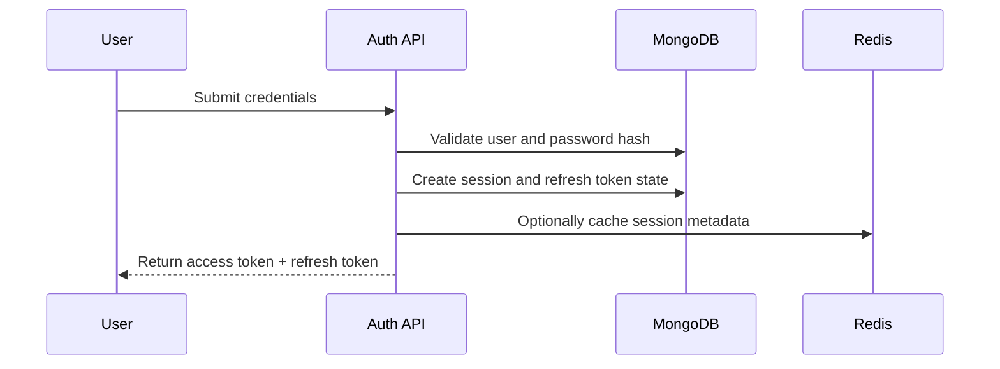

# 10. Authentication Design

## Purpose

This document defines the authentication design for the Multi-Tenant SaaS Backend.

It covers how users authenticate, how sessions are represented, how refresh tokens are managed, how password security is handled, and how authentication decisions are enforced across the platform. The design is intentionally practical, interview-defensible, and production-minded without over-engineering the system.

## Scope

This document covers:

- Authentication strategy.
- Registration and login flow.
- Access token and refresh token design.
- Password hashing and credential handling.
- Session lifecycle and revocation.
- Token rotation and reuse detection.
- Security considerations and failure behavior.

Out of scope:

- Frontend implementation details.
- Exact controller or repository code.
- Third-party identity provider integration.
- OAuth social login unless explicitly introduced later.

## Responsibilities

The authentication layer must:

- Verify user identity securely.
- Issue short-lived access tokens for API calls.
- Manage refresh tokens with rotation and revocation.
- Enforce session invalidation when needed.
- Record security-relevant authentication events.
- Avoid coupling authentication to tenant authorization decisions.

## Design Decisions

### 1. JWT for Access Tokens

The system uses JWTs for access tokens because they are stateless, easy to validate, and simple to explain in interviews.

Why this fits the project:

- The API is a modular monolith, so stateless auth is a natural fit.
- It reduces the need for server-side token storage for each request.
- It aligns well with a Node.js and Express backend.

### 2. Refresh Token Rotation

Refresh tokens are rotated on each successful use rather than reused indefinitely.

This improves security because:

- stolen refresh tokens have reduced value,
- replay attempts become detectable,
- session families can be revoked cleanly.

### 3. Password Hashing with bcrypt

Passwords are hashed using bcrypt to ensure adaptive cost and industry-standard protection.

### 4. Separate Session and Token State

Sessions and refresh token families are stored separately from the core user identity.

This keeps revocation logic explicit and auditable.

## Trade-offs

- JWT access tokens are simple and scalable for this architecture, but they require careful expiration and secret management.
- Refresh token rotation improves security but adds some complexity to the auth flow.
- Storing session metadata in MongoDB is straightforward, but it is less performant than a dedicated auth service for very large scale.

## Alternatives Considered

- Session-based auth with server-side sessions: simpler in some cases, but less aligned with the stateless API direction.
- OAuth social login only: useful later, but too broad for the initial documentation scope.
- Long-lived refresh tokens without rotation: simpler, but weaker from a security standpoint.

## Best Practices

- Keep access tokens short-lived.
- Hash refresh tokens before persistence.
- Enforce rate limiting on credential-based endpoints.
- Log authentication events without storing sensitive secrets.
- Use clear error handling so clients do not receive excessive information.

## Risks

- Poor secret rotation can weaken token trust.
- Weak or missing rate limiting can expose the login surface to abuse.
- Incomplete revocation logic can leave stale sessions active.
- Overly verbose errors can leak whether a user exists.

## Future Improvements

- Add support for refresh token family revocation and device tracking.
- Introduce optional email verification before full account activation.
- Add support for social login providers later if needed.

## Authentication Principles

- Authentication must be explicit and centralized.
- Access tokens should be short-lived.
- Refresh tokens should be rotation-based and revocable.
- Passwords must never be stored in plaintext.
- Session revocation and token reuse detection must be enforceable.
- Authentication must not be responsible for tenant authorization decisions.

## Authentication Model

The system uses a token-based authentication model with:

- Access tokens for API authorization.
- Refresh tokens for session renewal.
- Session records for revocation and audit context.

The access token is used for everyday requests. The refresh token is used only to mint a new access token and may be rotated on each use.

## High-Level Flow

## Credential Handling

### Registration

During registration:

- The email address is normalized before storage or comparison.
- The password is validated against documented strength rules.
- The password is hashed using bcrypt.
- The user account is created in an active or pending state depending on the final email verification policy.

### Login

During login:

- The submitted credentials are verified against the stored hash.
- A new session is created if the account is eligible to authenticate.
- A new access token and refresh token are issued.
- The previous refresh token family is not reused unless the design explicitly allows it.

### Password Reset

If password reset is introduced later, it should:

- Use a short-lived reset token.
- Store only a hash of the reset token.
- Emit an audit event for reset requests and completions.

## Token Design

### Access Token

Properties:

- Short-lived, for example 15 minutes.
- Contains subject identity and optionally organization context.
- Signed with a server-managed secret or asymmetric key pair.
- Includes standard claims such as `sub`, `iat`, `exp`, and `jti`.

### Refresh Token

Properties:

- Longer-lived, for example 7 to 30 days.
- Stored hashed in the database or secure token store.
- Rotated on every successful use.
- Associated with a specific session and user.
- Revocable on logout, password change, or suspicious reuse.

## Session Lifecycle

A session is created at login and can transition through the following states:

- Active.
- Revoked.
- Expired.
- Replaced by rotation.

Session revocation should be supported for:

- User logout.
- Global logout.
- Security incidents.
- Password change.
- Suspicious token reuse.

## Token Rotation and Reuse Detection

The authentication layer should implement refresh token rotation.

Behavior:

1. The client presents a refresh token.
2. The server validates that it exists, is active, and belongs to the current session.
3. The server issues a new refresh token and invalidates the old one.
4. If the old token is presented again, the server detects reuse and revokes the session family.

This prevents replay attacks and limits the impact of stolen refresh tokens.

## Storage Strategy

Authentication state should be stored in persistence structures that support revocation and auditing.

Recommended separation:

- `users`: account identity and password hash.
- `sessions`: logical session state and metadata.
- `refresh_tokens`: token family state and rotation tracking.

Token values themselves should never be stored in plaintext.

## Security Considerations

- Use secure cookie settings if cookies are adopted for refresh tokens.
- Apply rate limiting to login, registration, and refresh endpoints.
- Avoid revealing whether a user exists through login or reset error messages.
- Log authentication failures with correlation IDs and safe metadata.
- Rotate signing secrets carefully and support key rotation where possible.
- Reject tokens with invalid signatures, expired expiry claims, or revoked session state.

## Failure Behavior

Common authentication failures:

- Invalid credentials.
- Missing or malformed token.
- Expired access token.
- Expired refresh token.
- Revoked session.
- Reused refresh token.
- Rate limit exceeded.

Each failure should return a clear authentication error without leaking sensitive details.
