# 11. RBAC Design

## Purpose

This document defines the role-based access control design for the Multi-Tenant SaaS Backend.

It explains how authorization is modeled, how roles and permissions are structured, how access checks are enforced, and how the system protects tenant-scoped resources from unauthorized use.

## Scope

This document covers:

- Role and permission model.
- Authorization boundaries across platform and organization scopes.
- RBAC enforcement strategy.
- Role hierarchy and inheritance assumptions.
- Permission evaluation flow.
- Authorization risks and guardrails.

Out of scope:

- Frontend role UI implementation.
- Exact controller or service code.
- Advanced policy engine features beyond the initial scope.

## Responsibilities

The RBAC design must:

- Define clear roles for platform and organization-level actions.
- Support least privilege access.
- Enforce authorization consistently before sensitive operations run.
- Make permission evaluation easy to review and test.
- Protect tenant boundaries by default.

## Design Decisions

### 1. Role-Based Access Control with Explicit Roles

The system uses a simple RBAC model with explicit roles instead of a fully dynamic permission system.

This is appropriate because:

- the product scope is focused and manageable,
- interviewers can understand the model quickly,
- the design is easier to implement and test than a custom policy engine.

### 2. Multi-Scoped Roles

Roles are evaluated in the context of:

- platform-level access,
- organization-level access,
- team-level access,
- ticket-level access.

This ensures the backend can support different authority levels depending on context.

### 3. Authorization Before Business Logic

Authorization is enforced before workflows execute business logic.

This prevents accidental privilege escalation and makes the system easier to audit.

## Trade-offs

- A simple RBAC model is easier to explain and implement, but it is less flexible than a policy-driven approach.
- Hard-coded roles are easier to reason about, but they can become rigid as product requirements evolve.
- Checking permissions in middleware and service layers adds consistency, but it requires discipline to avoid duplicated checks.

## Alternatives Considered

- Attribute-based access control: more expressive, but too complex for the current scope.
- Permission-based systems without roles: flexible but much harder to understand and test.
- Client-side permission checks only: insecure and not acceptable for a production-grade design.

## Best Practices

- Prefer least privilege over broad access.
- Treat authorization as a security control, not an afterthought.
- Enforce checks at the service boundary for critical workflows.
- Avoid implicit trust in route-level assumptions.
- Make permission failures explicit and consistent.

## Risks

- Missing checks can create privilege escalation bugs.
- Role changes can leave stale permissions in long-lived sessions.
- Ambiguous role definitions can lead to inconsistent behavior across modules.
- Overly broad owner privileges can weaken tenant isolation.

## Future Improvements

- Introduce a permission matrix for finer-grained access control.
- Add policy-based checks for advanced workflow rules.
- Support temporary role grants or scoped admin access if the product grows.

## Core Roles

### Platform Super Admin

Responsibilities:

- Manage platform-level configuration.
- View system-wide operational data.
- Perform emergency support actions across tenants.

Scope:

- Platform-wide only.

### Organization Owner

Responsibilities:

- Manage organization settings.
- Invite and manage members.
- Assign organizational roles.
- Manage teams and tickets across the organization.

Scope:

- Organization-scoped.

### Organization Admin

Responsibilities:

- Manage most members and teams.
- Oversee organization support workflows.
- Support ticket operations.

Scope:

- Organization-scoped.

### Manager

Responsibilities:

- Manage team-level ticket routing.
- Assign tickets within their team.
- Monitor team workload and progress.

Scope:

- Organization and team-scoped.

### Agent

Responsibilities:

- Work on assigned tickets.
- Comment and attach files.
- Update ticket state when permitted.

Scope:

- Organization and ticket-scoped.

### Member

Responsibilities:

- Access basic organization information.
- View permitted tickets and notifications.
- Participate in collaboration workflows where allowed.

Scope:

- Organization-scoped.

## Permission Model

Permissions are grouped by business domain:

- `organization:read`
- `organization:update`
- `membership:read`
- `membership:create`
- `membership:update`
- `membership:delete`
- `team:read`
- `team:create`
- `team:update`
- `team:delete`
- `ticket:read`
- `ticket:create`
- `ticket:update`
- `ticket:delete`
- `comment:create`
- `comment:update`
- `attachment:create`
- `notification:read`
- `audit:read`

A role resolves to a set of permissions, and each request is evaluated using the current actor, requested resource, and organization context.

## Role-to-Permission Mapping

| Role | Core Permissions |
|---|---|
| Platform Super Admin | All platform permissions and elevated support access |
| Organization Owner | Full organization management and most ticket permissions |
| Organization Admin | Team and membership management plus broad ticket access |
| Manager | Team and assigned ticket management |
| Agent | Ticket and comment access for assigned or permitted work |
| Member | Basic read access and participation only |

## Authorization Flow

```mermaid
flowchart TD
    Request[Incoming Request] --> Auth[Authenticate User]
    Auth --> Tenant[Resolve Tenant Context]
    Tenant --> Role[Load Effective Role]
    Role --> Check[Evaluate Permissions]
    Check -->|Allow| Service[Execute Business Workflow]
    Check -->|Deny| Reject[Return 403 Forbidden]
```

## Enforcement Points

Authorization should be enforced at the following layers:

1. Route or middleware boundary for coarse checks.
2. Service layer for business-critical decisions.
3. Repository layer only for defense-in-depth where the resource is highly sensitive.

The primary enforcement point should remain the service layer, with middleware handling common access checks for organization-scoped routes.

## Tenant-Aware Authorization

Authorization decisions must always include the current organization context.

This means the backend must verify:

- the user is a member of the organization,
- the membership is active,
- the requested resource belongs to that organization,
- the actor has the required permission for the action.

If any of these checks fail, the request should be denied.

## Special Rules

### Final Owner Protection

The organization owner role must not be removed if they are the last active owner in the organization.

### Team Assignment Protection

Managers and agents should only be assigned to teams within the same organization.

### Ticket Access Rules

Ticket visibility should be based on:

- ownership,
- assignment,
- team membership,
- organization role,
- explicit sharing rules if introduced later.

## Authorization Errors

Common authorization failures:

- `401 Unauthorized` for missing or invalid authentication.
- `403 Forbidden` for valid authentication with insufficient privileges.
- `404 Not Found` for resources that the user is not allowed to see.

The system should avoid revealing whether a resource exists when the user lacks access.

## Testing Expectations

Authorization logic should be tested with scenarios such as:

- owner can manage organization settings,
- admin cannot remove the final owner,
- agent cannot delete tickets without permission,
- member cannot access audit logs,
- cross-tenant access is blocked.
