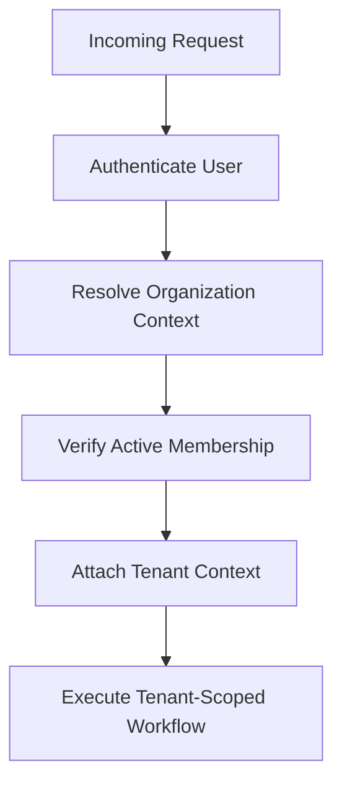

# 12. Multi-Tenancy Design

## Purpose

This document defines the multi-tenancy design for the Multi-Tenant SaaS Backend.

It explains how the system isolates tenant data, resolves organization context, enforces access boundaries, and keeps the architecture practical for a startup-style SaaS platform.

## Scope

This document covers:

- Tenant model and ownership rules.
- Shared database multi-tenancy strategy.
- Tenant context resolution.
- Data isolation patterns.
- Cross-tenant protection mechanisms.
- Operational considerations for multi-tenant deployments.

Out of scope:

- Database-per-tenant or schema-per-tenant implementations.
- Advanced tenant billing or enterprise isolation features.
- Full platform federation or cross-tenant analytics.

## Responsibilities

The multi-tenancy design must:

- Keep tenant data isolated by default.
- Make organization context explicit in every tenant-scoped workflow.
- Prevent accidental leakage across organizations.
- Support tenant-aware authorization and auditing.
- Remain simple enough to explain and implement in a portfolio project.

## Design Decisions

### 1. Shared Database, Shared Application, Isolated Data

The system uses a shared database and shared application instance with explicit tenant scoping.

This is the right balance because:

- it is simpler to build than isolated infrastructure per tenant,
- it is easier to explain in interviews,
- it is realistic for a startup-grade backend,
- it keeps the architecture maintainable while still honoring tenant boundaries.

### 2. Organization as the Tenant Boundary

The organization is the primary tenant boundary.

All tenant-scoped resources belong to an organization, and authorization is evaluated within that organization context.

### 3. Explicit Tenant Context in Every Request

Tenant context is resolved from:

- the authenticated user,
- the organization identifier in the path or body,
- the active membership record.

This makes tenant resolution predictable and auditable.

## Trade-offs

- Shared database multi-tenancy is operationally simpler than database-per-tenant, but it requires disciplined filtering and testing.
- Organization-based scoping is easy to reason about, but it becomes more complex as features grow beyond a single tenant model.
- Explicit tenant context improves safety but adds some request complexity.

## Alternatives Considered

- Database-per-tenant: stronger isolation but much heavier to operate.
- Schema-per-tenant: flexible but more complex to manage.
- Implicit tenant inference from user identity alone: simpler at first but fragile and risky.

## Best Practices

- Require `organizationId` on every tenant-scoped document.
- Always filter by organization context in queries.
- Enforce authorization before accessing tenant resources.
- Use audit logs to track cross-tenant or security-sensitive actions.
- Write tenant-isolation tests for every major module.

## Risks

- Missing organization filters can cause serious data leakage.
- Poor tenant resolution can lead to authorization bypasses.
- Shared infrastructure can become noisy if tenants are not isolated in observability and logging.
- Operational mistakes can affect all tenants in a shared environment.

## Future Improvements

- Introduce tenant-level rate limiting and settings.
- Add tenant-specific configuration and feature flags.
- Support stricter isolation if the product grows beyond the initial portfolio scope.

## Tenant Model

The system treats each organization as a tenant.

Each tenant owns:

- its members,
- its teams,
- its tickets,
- its comments,
- its attachments,
- its notifications,
- its audit logs.

Users may belong to multiple organizations, but their role and privileges are evaluated separately within each one.

## Tenant Resolution Strategy

Tenant context should be resolved in the following order:

1. Authenticate the user.
2. Identify the target organization from the request path or payload.
3. Verify the user has an active membership in that organization.
4. Attach the organization context to the request.
5. Enforce authorization and data access using that context.

## Data Isolation Model

### Tenant-Scoped Collections

Every collection that stores tenant-owned business data must include:

- `organizationId`.

Examples include:

- `memberships`
- `teams`
- `tickets`
- `comments`
- `attachments`
- `notifications`
- `audit_logs`

### Cross-Tenant Safety Rules

Every read or write to a tenant-scoped collection must:

- include the current `organizationId` in the query or write context,
- validate that the resource belongs to that organization,
- reject the request if the context is missing or invalid.

## Repository and Query Conventions

Repository methods for tenant-owned data should follow a consistent pattern:

- `findByOrganization(organizationId, filters)`
- `findOneByOrganization(organizationId, id)`
- `createForOrganization(organizationId, payload)`
- `updateInOrganization(organizationId, id, payload)`

These conventions make it easier to review and test that tenant boundaries are not being bypassed.

## Membership and Tenant Access

A user can access an organization only when they have:

- an active membership,
- a valid role,
- an allowed permission for the requested action.

Membership status must be checked before any tenant-scoped operation proceeds.

## Tenant Lifecycle

Organizations may move through lifecycle states such as:

- active,
- suspended,
- deactivated.

Tenant-scoped access should be denied or limited when an organization is not active.

## Audit and Observability for Tenants

Every tenant-relevant action should be logged with:

- `organizationId`,
- actor identity,
- action type,
- resource identifier,
- timestamp.

This supports security review and operational debugging without exposing data across tenants.

## Security Considerations

- Never infer tenant context from a user ID alone.
- Never allow a request to target a different organization without explicit validation.
- Never expose tenant identifiers or resource data across organizations.
- Ensure all tenant-scoped endpoints are covered by authorization and isolation tests.

## Testing Expectations

The following test categories should be included:

- user from organization A cannot read organization B tickets,
- cross-tenant ticket update is rejected,
- organization-scoped listing only returns records for the current organization,
- membership revocation removes access immediately.
