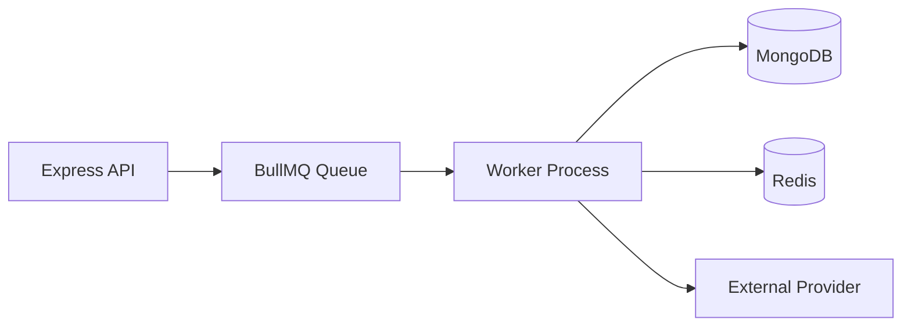

# 13. Background Jobs

## Purpose

This document defines the background job design for the Multi-Tenant SaaS Backend.

It explains when asynchronous processing is appropriate, how jobs are queued and executed, how reliability is handled, and how the system keeps jobs observable and safe for a production-oriented SaaS backend.

## Scope

This document covers:

- When background jobs are appropriate.
- Queue architecture and job types.
- Job lifecycle, retries, and failure handling.
- BullMQ integration strategy.
- Idempotency and observability expectations.
- Worker design and operational concerns.

Out of scope:

- Full event-driven architecture beyond the current job model.
- Third-party webhook implementations.
- Complex workflow orchestration beyond the initial product scope.

## Responsibilities

The background jobs system must:

- Move slow or non-blocking work out of the request path.
- Preserve correctness for notification and cleanup workflows.
- Make failures observable and recoverable.
- Avoid duplicate processing where possible.
- Keep the job model simple and interview-defensible.

## Design Decisions

### 1. BullMQ for Background Processing

The system uses BullMQ with Redis as the backing store.

This is appropriate because:

- it fits the existing stack well,
- it is a common and practical job queue for Node.js,
- it provides retry, delay, and queue separation capabilities,
- it is easier to explain than a more complex distributed event system.

### 2. Queue-Based Asynchronous Workflows

Notifications, cleanup tasks, and external-side effects are handled asynchronously.

This prevents blocking user-facing API requests and keeps the web layer responsive.

### 3. Idempotent Job Design

Jobs are designed to be safe to retry.

This is critical because queue failures and worker restarts are normal operational events.

## Trade-offs

- Background jobs improve responsiveness but add operational complexity.
- Redis-backed queues are simple and practical, but they are not a replacement for a full event bus.
- Retry policies improve resilience but can amplify load if they are misconfigured.

## Alternatives Considered

- Direct synchronous processing in the request cycle: simpler at first, but poor for user experience and reliability.
- Kafka or a message broker: more scalable, but unnecessary for this scope.
- Custom in-memory queueing: not resilient enough for production-style behavior.

## Best Practices

- Keep jobs small and focused.
- Make every job idempotent where practical.
- Include correlation and tenant context in each job payload.
- Use dead-letter handling for repeated failures.
- Log job start, success, failure, and retry events clearly.

## Risks

- Duplicate job execution can create repeated side effects.
- Failure to persist tenant context can cause cross-tenant job mistakes.
- Poor retry policy can create retry storms.
- Workers that depend on unavailable external systems can degrade queue health.

## Future Improvements

- Add workflow-level tracing and job metrics.
- Introduce delayed and scheduled jobs for recurring maintenance.
- Add more advanced dead-letter and replay strategies if the platform grows.

## Queue Strategy

The system will use the following queue categories:

- `notifications`: sends email, in-app, or other user-facing alerts.
- `cleanup`: removes stale tokens, expired invitations, or temporary records.
- `analytics`: optional background aggregation work if needed later.
- `external-integrations`: callouts to third-party providers.

Each queue should be purpose-specific and avoid mixing unrelated responsibilities.

## Job Types

### Notification Jobs

Responsible for:

- delivering ticket assignment notifications,
- notifying users about invitations,
- sending password reset or verification events if implemented,
- marking notifications as sent or failed.

### Cleanup Jobs

Responsible for:

- removing expired invitations,
- clearing stale sessions,
- pruning old rate-limit records,
- deleting soft-deleted records beyond retention thresholds.

### Retry and Recovery Jobs

Responsible for:

- retrying transient provider failures,
- reprocessing partially failed workflows,
- moving jobs to dead-letter queues after repeated failure.

## BullMQ Design

The system should use:

- a Redis connection adapter,
- named queues for each purpose,
- worker processes for job execution,
- retries with exponential backoff,
- job metadata for tenant, actor, and correlation IDs.

## Job Lifecycle

Each job should follow a lifecycle like this:

1. The application creates a job payload.
2. The payload is added to the appropriate BullMQ queue.
3. A worker picks up the job.
4. The worker processes the job and updates the source-of-truth state.
5. The job result is recorded, and the worker marks the job complete or failed.

## Retry and Failure Handling

Recommended behavior:

- retry transient failures automatically,
- apply exponential backoff,
- limit total retry attempts,
- move permanently failing jobs to a dead-letter queue or similar failure archive,
- preserve enough context to investigate failures later.

## Idempotency Strategy

Jobs should be designed so repeated execution does not create inconsistent results.

Strategies include:

- checking whether an operation has already been completed before redoing it,
- using unique keys for de-duplication,
- storing a job execution fingerprint in the database.

## Observability

Jobs should emit structured logs with:

- job name,
- job ID,
- organization ID,
- tenant context,
- attempt number,
- error code,
- timestamp.

This makes it easier to debug queues during interviews and in future operations.

## Worker Safety Rules

Workers must:

- use tenant-aware context for every job,
- avoid direct business logic in the queue adapter layer,
- use service-layer functions for actual processing,
- respect the same authorization and validation rules as the API layer where applicable.

## Testing Expectations

The system should include tests for:

- successful queue processing,
- retry behavior on transient failure,
- dead-letter handling on persistent failure,
- idempotency under repeated execution,
- tenant-aware processing for organization-scoped jobs.
