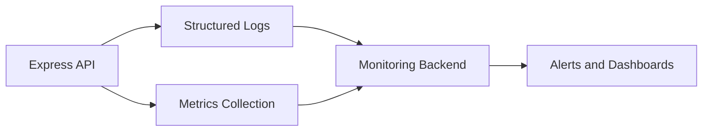

# 15. Logging and Monitoring

## Purpose

This document defines the logging and monitoring strategy for the Multi-Tenant SaaS Backend.

It explains how the system records operational events, structures logs for troubleshooting, monitors health, and preserves enough observability to support a production-grade SaaS backend without over-engineering the initial implementation.

## Scope

This document covers:

- Logging strategy.
- Structured logging conventions.
- Request correlation and traceability.
- Health checks and dependency monitoring.
- Metrics and alerting expectations.
- Operational visibility for auth, tenant, ticket, queue, and infrastructure events.

Out of scope:

- Full APM platform setup beyond the documented approach.
- Large-scale distributed tracing across multiple services.
- Complex dashboarding beyond what is practical for the portfolio scope.

## Responsibilities

The logging and monitoring design must:

- make failures diagnosable,
- preserve request context across layers,
- help support and operations teams investigate incidents,
- expose health and readiness information for deployment flows,
- avoid logging sensitive data.

## Design Decisions

### 1. Structured Logging

The system uses structured JSON logs rather than plain text logs.

This is appropriate because:

- logs are easier to search and filter,
- they support future dashboards and alerting,
- they are more interview-friendly and professional.

### 2. Correlation IDs

Every incoming request receives a correlation ID that follows the request through the API, services, workers, and logs.

### 3. Health Checks for Core Dependencies

The application exposes health endpoints for liveness and readiness so deployments and infrastructure can monitor the service safely.

## Trade-offs

- Structured logs are more machine-readable but slightly more verbose than simple logs.
- Request correlation improves debugging but adds request context plumbing.
- A lightweight monitoring approach is easier to implement, but it is less rich than a full enterprise observability stack.

## Alternatives Considered

- Plain text logs only: easy to start, but poor for search and analysis.
- Full distributed tracing platform immediately: useful later, but unnecessary for the initial scope.
- Logging everything verbosely: too noisy and expensive to maintain.

## Best Practices

- Log business events and operational events separately where practical.
- Never log passwords, secrets, refresh tokens, or raw authorization headers.
- Include correlation IDs and organization context when relevant.
- Emit warnings and errors with enough context for root cause analysis.
- Keep the logging shape consistent across modules.

## Risks

- Logging sensitive data can create a serious security issue.
- Missing correlation IDs can make incident investigation difficult.
- Too much logging can hurt performance and increase storage cost.
- Incomplete health checks can hide dependency failures.

## Future Improvements

- Add Prometheus metrics and Grafana dashboards.
- Add alert rules for latency spikes, queue backlog, and failed auth attempts.
- Expand tracing across workers and external integrations.

## Logging Model

### Application Logs

Application logs should include:

- timestamp,
- log level,
- service name,
- correlation ID,
- request method and path,
- user ID when safe,
- organization ID when relevant,
- action or event name,
- duration where useful,
- error details for failures.

### Audit Logs

Audit logs are separate from application logs and should capture:

- user registration,
- login success and failure,
- password changes,
- organization changes,
- role changes,
- ticket updates,
- security-relevant actions.

These should be structured and immutable where possible.

## Structured Logging Example

```json
{
  "timestamp": "2026-07-06T10:15:30.000Z",
  "level": "info",
  "service": "api",
  "event": "ticket.created",
  "correlationId": "req_123",
  "organizationId": "org_456",
  "userId": "user_789",
  "ticketId": "ticket_001"
}
```

## Request Correlation

Every request should receive:

- a correlation ID,
- a request ID,
- an optional user ID or organization ID in the log context,
- consistent propagation through downstream jobs and workers.

This allows the team to follow one user action across the API, database, and background jobs.

## Health Checks

### Liveness

The liveness endpoint should report whether the process is up.

It should not depend on downstream services.

### Readiness

The readiness endpoint should report whether:

- the API can accept traffic,
- MongoDB is reachable,
- Redis is reachable,
- required environment variables are available.

## Metrics to Track

The following operational metrics should be collected:

- API request volume,
- API latency by endpoint,
- status code distribution,
- authentication failure rate,
- ticket creation rate,
- queue depth,
- job success and failure rate,
- database latency,
- Redis latency,
- error rate by module.

## Alerting Expectations

Basic alerting should cover:

- elevated 5xx error rate,
- high auth failure spikes,
- queue backlog growth,
- Redis connectivity issues,
- MongoDB latency or reachability problems,
- health endpoint failures.

## Monitoring Workflow



## Testing Expectations

The logging and monitoring design should be validated through:

- verifying correlation IDs are propagated correctly,
- ensuring auth and ticket events log with the right fields,
- checking health endpoints return the expected status,
- verifying logs do not include sensitive values,
- validating alert conditions against simulated failures.
