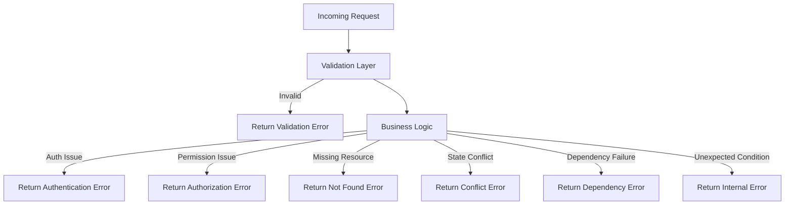

# 16. Error Handling

## Purpose

This document defines the production-grade error handling strategy for the Multi-Tenant SaaS Backend. It establishes a consistent, secure, and operationally observable approach to failures across authentication, authorization, validation, tenancy, domain logic, and infrastructure dependencies.

The design objective is to ensure that the platform degrades predictably under failure conditions, preserves trust in the API contract, and provides sufficient diagnostic context for engineering and support teams without exposing internal implementation details to clients.

## Scope

This document covers:

- error taxonomy and classification,
- centralized error handling principles,
- API error response contract,
- status code strategy,
- logging and observability requirements,
- security and privacy expectations,
- testing and acceptance criteria.

Out of scope:

- detailed implementation code,
- frontend presentation logic,
- third-party incident reporting tooling beyond the reference approach.

## Design Principles

The error handling design is guided by the following principles:

1. Consistency: Every failure should be translated into a predictable response shape.
2. Security: Sensitive internals must never be exposed through public error payloads.
3. Traceability: Errors must be correlated with requests, tenants, and users where appropriate.
4. Operability: Support teams and engineers must be able to diagnose issues quickly.
5. Resilience: Recoverable failures should be handled gracefully without causing cascading breakdowns.

## Responsibilities

The backend must:

- return clear and stable error responses for clients,
- preserve enough context for debugging and incident response,
- distinguish user-facing issues from platform-level failures,
- support multi-tenant isolation even when errors occur,
- ensure that failures are testable, auditable, and observable.

## Architectural Approach

### Centralized Error Handling

The platform should rely on a centralized error handling layer rather than scattered exception handling throughout the application. This ensures that all layers behave consistently and that error translation is performed in a single, auditable place.

This approach reduces duplication, improves maintainability, and enables future enforcement of common policies such as correlation IDs, error codes, and rate-limit behavior.

### Typed Error Model

Errors should be represented through explicit domain-level categories rather than relying on raw exceptions alone. The system should support distinct classes for:

- validation failures,
- authentication failures,
- authorization failures,
- resource not found,
- conflict and state transition errors,
- dependency and infrastructure failures,
- unexpected internal errors.

This model makes the system easier to reason about and easier to test.

### Safe Client Responses

Client-visible error payloads should be concise, professional, and non-sensitive. Internal logs and diagnostics should retain additional context for engineering use.

## Error Taxonomy

| Error Type | Purpose | Typical Examples |
|---|---|---|
| Validation Error | Indicates malformed or incomplete input | missing email, invalid status, invalid tenant ID |
| Authentication Error | Indicates that the requester is not authenticated or credentials are invalid | expired token, invalid refresh token, missing bearer token |
| Authorization Error | Indicates the requester is authenticated but lacks the required permission | forbidden access to organization audit logs, cross-tenant access attempt |
| Not Found Error | Indicates a requested resource does not exist or is unavailable to the current context | missing ticket, missing organization, deleted resource |
| Conflict Error | Indicates a state or uniqueness violation | duplicate email, duplicate team name, invalid status transition |
| Dependency Error | Indicates the failure of an upstream or supporting system | MongoDB timeout, Redis outage, notification provider failure |
| Internal Error | Indicates an unexpected or unhandled system condition | programming defect, unexpected runtime failure |

## Standard API Error Contract

All API errors should follow a consistent envelope.

```json
{
  "error": {
    "code": "VALIDATION_ERROR",
    "message": "One or more fields are invalid.",
    "details": [
      {
        "field": "email",
        "message": "Email is required."
      }
    ],
    "requestId": "req_123",
    "timestamp": "2026-07-06T12:00:00Z"
  }
}
```

### Recommended Fields

- `code`: stable machine-readable error identifier.
- `message`: concise human-readable summary suitable for clients.
- `details`: optional field-level or actionable information.
- `requestId`: correlation identifier for support and operational debugging.
- `timestamp`: time of error generation for analysis and audit purposes.

## HTTP Status Mapping

| Error Type | Recommended Status |
|---|---:|
| Validation Error | 400 or 422 |
| Authentication Error | 401 |
| Authorization Error | 403 |
| Not Found Error | 404 |
| Conflict Error | 409 |
| Dependency Error | 503 |
| Internal Error | 500 |

## Error Handling Flow



## Logging and Observability Requirements

Errors must be logged with sufficient context to support incident investigation and postmortem analysis. The minimum logging context should include:

- correlation ID,
- request path and method,
- tenant identifier when available,
- user identifier when safe and permitted,
- error code and category,
- error message,
- relevant upstream dependency context,
- stack trace for internal logs only.

Sensitive data such as raw passwords, access tokens, and secrets must never be logged.

## Security and Privacy Considerations

The error handling layer must enforce the following safeguards:

- no stack traces in public API responses,
- no raw database or framework exceptions exposed to clients,
- no tenant-specific information disclosed in cross-tenant failures,
- no secrets or credentials included in logs or error payloads,
- consistent handling of authentication and authorization failures to avoid information leakage.

## Operational Expectations

The platform should treat error handling as an operational capability, not merely a coding convention. Production systems must be able to:

- distinguish transient failures from hard failures,
- trigger retries or fallback logic where appropriate,
- alert on abnormal error rates and spike patterns,
- support correlation across logs, traces, and metrics,
- preserve customer-facing stability during dependency outages.

## Trade-offs

- Centralized handling improves consistency and maintainability, but it requires disciplined design and governance.
- Rich internal diagnostics improve operability, but they must be carefully restricted to avoid information disclosure.
- Typed errors improve correctness and testability, but they introduce additional structure that must be maintained over time.

## Alternatives Considered

- ad hoc try/catch blocks throughout the application: simpler initially, but inconsistent and difficult to govern at scale,
- returning raw framework exceptions directly: fast to implement, but unacceptable for production quality and security,
- relying only on framework defaults: insufficient for multi-tenant SaaS platforms with complex operational requirements.

## Testing Expectations

The system should include automated tests for:

- validation failures,
- authentication failures,
- authorization failures,
- not-found behavior,
- conflict handling,
- dependency failure behavior,
- error payload consistency,
- tenant isolation in error scenarios.

## Future Improvements

The following enhancements may be introduced as the platform matures:

- domain-specific error codes for critical business workflows,
- richer error analytics and trend monitoring,
- structured error budgets and SLO-aware alerting,
- expanded handling for asynchronous job failures and retry policies.
