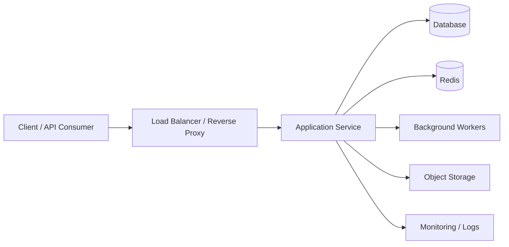

# 19. Infrastructure and Deployment

## Purpose

This document defines the infrastructure and deployment architecture for the Multi-Tenant SaaS Backend. It establishes the production operating model for hosting, scaling, availability, environment management, and release delivery in a way that is suitable for a modern cloud-native SaaS platform.

The design emphasizes reliability, security, repeatability, and operational clarity while avoiding unnecessary complexity.

## Scope

This document covers:

- deployment topology,
- environment strategy,
- containerization and runtime model,
- infrastructure components,
- deployment workflow,
- availability and scaling considerations,
- operational handoff expectations.

Out of scope:

- low-level infrastructure provisioning scripts,
- vendor-specific implementation details beyond the recommended architecture,
- detailed disaster recovery runbooks.

## Deployment Objectives

The deployment architecture should support:

- predictable releases,
- isolated environments for development, staging, and production,
- resilient service operation,
- secure secret and configuration handling,
- horizontal scalability for increasing demand,
- traceable operational changes.

## Architectural Approach

The recommended model is a modular monolith deployed as a containerized service behind a reverse proxy or load balancer, with supporting infrastructure for databases, cache, background workers, and observability.

This approach provides a strong balance between simplicity and production readiness while keeping operational overhead manageable.

## Environment Strategy

The platform should be deployed across at least three environments:

- Development: for active feature work and local validation,
- Staging: for integration testing and release rehearsal,
- Production: for customer-facing traffic and critical workloads.

Each environment should have isolated credentials, configuration values, and operational monitoring.

## Runtime Architecture

### Core Components

The production deployment should include:

- application service instances,
- a managed database,
- a managed cache layer,
- background worker processes,
- object storage or attachment storage where required,
- logging and monitoring services,
- reverse proxy or load balancer.

### Deployment Topology

## Containerization

The application service should be packaged as a container image for deployment consistency across environments.

### Expected Characteristics

- immutable build artifacts,
- environment-driven configuration,
- container health checks,
- minimal runtime dependencies,
- support for rolling deployments.

## Configuration Management

Configuration should be environment-specific and injected at runtime rather than embedded into application images.

### Required Practices

- no secrets in source control,
- environment variables or secret stores for sensitive configuration,
- distinct configuration profiles per environment,
- clear separation between application config and infrastructure config.

## Availability and Scaling

### Availability Considerations

The deployment design should target resilience through:

- redundant application instances,
- managed database high availability where feasible,
- cache redundancy and failover support,
- health checks and automated restarts,
- graceful degradation during partial outages.

### Scaling Model

The platform should support:

- horizontal scaling of application instances,
- worker scaling for background jobs,
- connection pool tuning for database access,
- cache-based reduction of repeated load where appropriate.

## Release and Deployment Workflow

A production-grade release process should include:

- automated build and validation,
- environment promotion through controlled stages,
- deployment rollback strategy,
- release health verification,
- change logging and auditability.

### Recommended Flow

1. Build and test in CI.
2. Deploy to staging for validation.
3. Promote to production through a controlled rollout.
4. Verify health, logs, and key metrics.
5. Roll back quickly if release health degrades.

## Observability Integration

Deployment architecture should be designed to support observability from the start.

### Required Integration Points

- application logs,
- metrics collection,
- health endpoints,
- tracing where supported,
- alerting based on service health and error rates.

## Security Considerations

Infrastructure design must align with the security model of the platform.

### Deployment Security Requirements

- private network boundaries where possible,
- least-privilege access for deployment systems,
- secrets managed outside application source code,
- HTTPS termination and secure transport,
- restricted administrative access to production infrastructure.

## Operational Responsibilities

The deployment model should define clear ownership for:

- application releases,
- environment configuration,
- infrastructure monitoring,
- incident escalation,
- rollback decisions.

## Trade-offs

- containerization and orchestration improve consistency but add operational complexity,
- stronger availability increases cost and operational overhead,
- more environments improve safety but require additional maintenance.

## Alternatives Considered

- single-instance deployment: simpler, but not appropriate for production resilience,
- microservices decomposition too early: increases operational complexity without clear business need,
- manual deployment processes: error-prone and difficult to audit.

## Future Improvements

The infrastructure model can evolve to include:

- automated scaling policies,
- stronger multi-region redundancy,
- infrastructure-as-code maturity,
- deeper automation for incident response and rollback.
